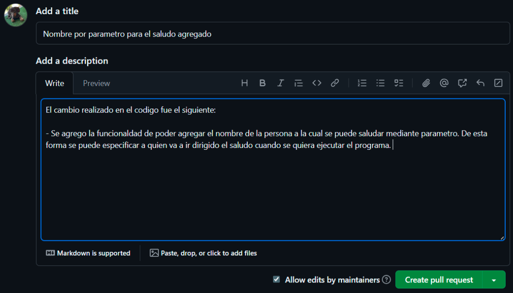
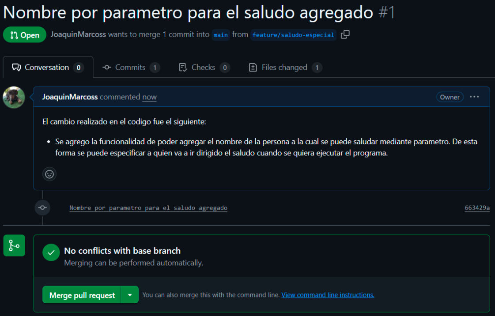
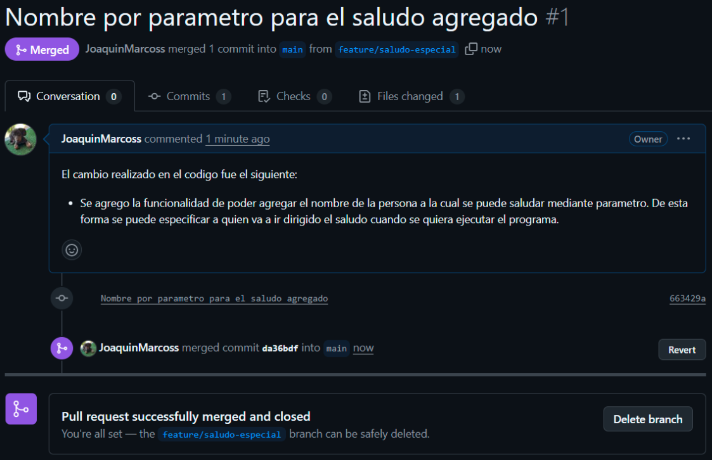
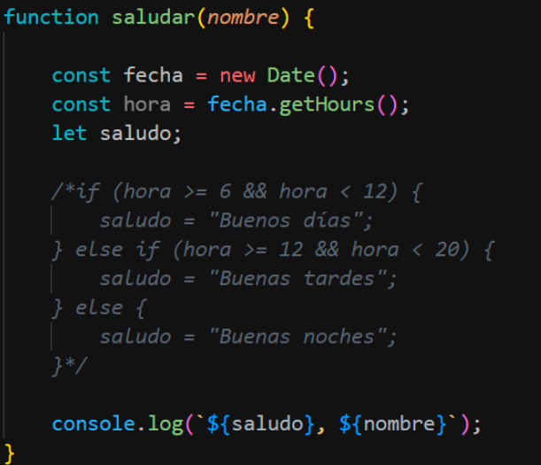

# Trabajo Práctico 1 - Git Básico
Repositorio donde se realizó TP1: 
- https://github.com/JoaquinMarcoss/2025_TP01_RepoBase.git

---

Como primer paso lo que hicimos fue forkear y posteriormente clonar el repositorio base para trabajar: 
- https://github.com/ingsoft3ucc/2025_TP01_RepoBase

Una vez hecho eso configuramos nuestra identidad: 
- git config user.name "Joaquin Marcos"
- git config user.email "2204468@ucc.edu.ar"

## Desarrollo de funcionalidad 

#### Branching Model elegido → Github Flow

Github Flow es un flujo simple y ágil basado en una sola rama principal que siempre debe estar estable y lista para producción. Todas las nuevas funcionalidades, correcciones y experimentos se hacen en ramas cortas que se crean a partir de main. Cada rama se integra a main mediante Pull Request, revisada y testeada antes de mergear.

**Ramas** 

- *main* → Rama principal, siempre estable y lista para producción.  
- *feature/nueva-funcionalidad* → Ramas para desarrollar nuevas funcionalidades. 
- *hotfix/correccion-error* → Ramas cortas para corregir errores en producción. 

Para desarrollar una funcionalidad vamos a crear una rama nueva llamada *feature/saludo-especial*, para eso realizamos lo siguiente: 
- git branch feature/saludo-especial
- git checkout feature/saludo-especial

Pusheamos la rama al repositorio remoto: 
- git push -u origin feature/saludo-especial

La primera funcionalidad que vamos a agregar es una personalización del saludo agregando el nombre de la persona a la que se quiere saludar por parámetro. Una vez terminado el cambio hacemos lo siguiente posicionados sobre la rama feature/saludo-especial: 
- git add .
- git commit -m "Nombre por parametro para el saludo agregado"
- git push origin feature/saludo-especial 

Ahora lo que sigue es realizar una pull request desde GitHub para solicitar que los cambios realizados en la rama feature/saludo-especial se fusionen con la rama main:

Una vez creada la pull request, observamos la petición. Como no genera conflicto podemos realizar el merge: 

Dando como resultado: 

Ahora como la primera funcionalidad fue integrada a la rama main con exito, podemos seguir utilizando la rama de desarrollo para agregar alguna funcionalidad nueva. 

La siguiente funcionalidad a agregar será cambiar el saludo dependiendo el horario en el cual estamos. Para poder realizar eso, se obtiene la hora actual utilizando las funciones de javascript Date y getHours(). Luego, se determina un mensaje según el rango horario:
- 06:00 – 11:59 → "Buenos días"
- 12:00 – 19:59 → "Buenas tardes"
- 20:00 – 05:59 → "Buenas noches"

Una vez probado todo, se agrega y pushea el cambio en la rama feature/saludo-especial: 
- git add .
- git commit -m "Mensaje de saludo segun el horario agregado"
- git push origin feature/saludo-especial 

Por ultimo, como se hizo con la primera funcionalidad, creamos una pull request para solicitar que estos nuevos cambios se fusionen con la rama principal. 

## Simulación de error

En esta parte del trabajo, desde la rama main, vamos a comentar una parte del código, simulando un error: 

- git add .
- git commit -m "simulacion de error en main"
- git push origin main

Con el error simulado, creamos la rama *hotfix/fix-saludo* para poder solucionarlo, donde una vez solucionado realizamos el commit: 
- git add .
- git commit -m "error en funcion saludar corregido"

Ahora aplicamos la corrección a la rama main y la rama de desarrollo utilizando git merge. Se eligio el merge como técnica para integrar el fix porque sirve para preservar el historial y mantener el contexto, además de que es parte del flujo GitHub Flow: 
- git checkout main
- git merge hotfix/fix-saludo
- git checkout feature/saludo-especial
- git merge hotfix/fix-saludo

## Creación de versión etiquetada

Para la creación del tag hacemos lo siguiente, posicionados en rama main: 
- git tag -a v1.0 -m "Versión estable 1.0"
- git push origin v1.0
Se utiliza -a para crear un tag anotado, que incluye mensaje, autor y fecha.

La convención utilizada fue el versionado Semántico (SemVer). SemVer es un estándar utilizado en la industria del software para asignar números de versión de forma clara y predecible. El mismo se basa en la siguiente estructura: MAJOR.MINOR.PATCH

**MAJOR (X.0.0)** → Se incrementa cuando hay cambios incompatibles con versiones anteriores.
**MINOR (0.X.0)** → Se incrementa cuando se agregan funcionalidades nuevas de manera compatible hacia atrás.
**PATCH (0.0.X)** → Se incrementa cuando se realizan correcciones de errores o mejoras pequeñas que no afectan las funcionalidades.

En nuestro caso, creamos la etiqueta v1.0 porque representa la primera versión estable del proyecto. No se usó ni PATCH ni MINOR, con el fin de marcar que es este es el punto de inicio base sobre el cual el sistema va a evolucionar. Al ser un tag anotado, se guarda la referencia del commit, el autor, la fecha y un mensaje descriptivo. Esto se hace con el fin de asegurar la trazabilidad y calidad, permitiendo identificar claramente qué cambios conforman las distintas versiones.