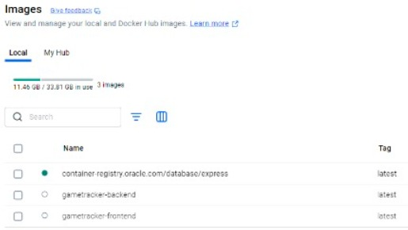
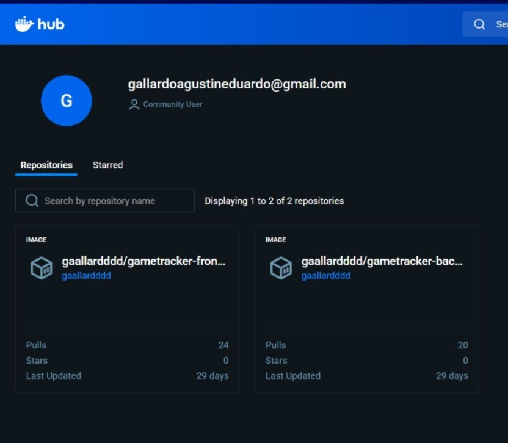
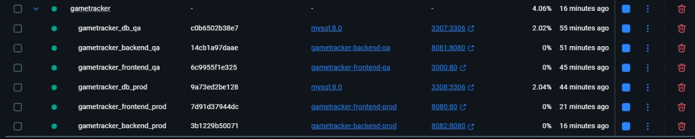
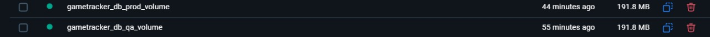
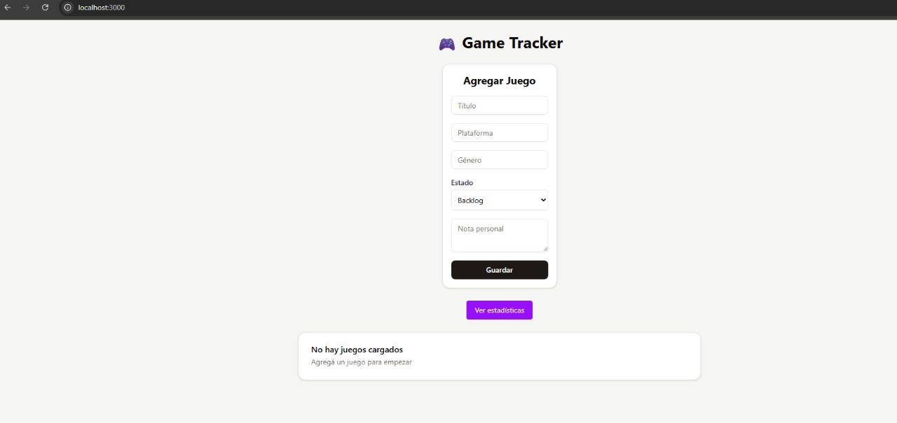
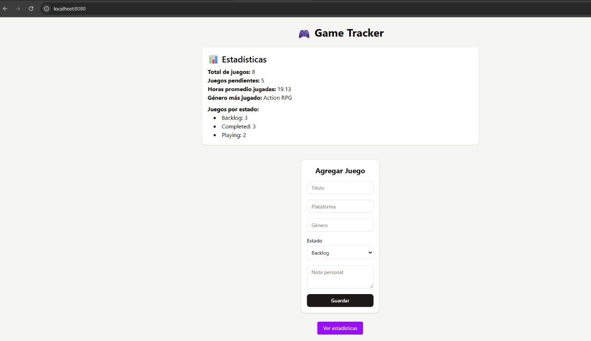
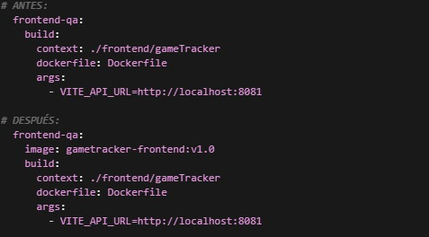

# Trabajo Práctico 2 -  Introducción a Docker

Acceso al repo: https://github.com/Gaallard/GameTracker

---

## Preparacion de aplicación

La aplicación web elegida es la siguiente: Game Tracker. La aplicación permite gestionar tu biblioteca de videojuegos y esta organizado en dos carpetas principales: 
- /frontend/gameTracker 
- /back 
En este caso ya contábamos con el entorno docker configurado. 

---

## Construcción de imagen personalizada

Para la aplicación se crearon dos Dockerfile, uno para backend y otro para el frontend.

### Dockerfile Backend
```yaml
#Build stage
FROM golang:1.23.2-alpine AS builder
WORKDIR /app

#Copy go mod files
COPY go.mod go.sum ./

#Download dependencies
RUN go mod download

#Copy source code
COPY . .

#Build the application
RUN CGO_ENABLED=0 GOOS=linux go build -a -installsuffix cgo -o main .

#Final stage
FROM alpine:latest
RUN apk --no-cache add ca-certificates
WORKDIR /root/

#Copy the binary from builder stage
COPY --from=builder /app/main .

#Expose port
EXPOSE 8080

#Run the application
CMD ["./main"]
```
### Estructura del dockerfile


### Dockerfile Frontend
```yaml
#Build stage
FROM node:18-alpine AS builder
WORKDIR /app

#Copy package files
COPY package*.json ./

#Install dependencies
RUN npm ci

#Copy source code
COPY . .

#Accept build arguments for environment variables
ARG VITE_API_URL
ENV VITE_API_URL=$VITE_API_URL

#Build the application
RUN npm run build

#Production stage
FROM nginx:alpine

#Copy built files to nginx
COPY --from=builder /app/dist /usr/share/nginx/html

#Copy nginx configuration
COPY nginx.conf /etc/nginx/conf.d/default.conf

#Expose port
EXPOSE 80

#Start nginx
CMD ["nginx", "-g", "daemon off;"]
```

Para poder crear imagen etiquetándola con un nombre ejecutamos el siguiente comando. El punto final le indica a Docker que use el directorio actual:
- docker build -t gametracker-backend .
- docker build -t gametracker-frontend .



Procedemos a etiquetar las imágenes con nuestro usuario de Docker Hub y un tag significativo:
- docker tag gametracker-backend gaallardddd/gametracker-backend:v1.0
- docker tag gametracker-frontend gaallardddd/gametracker-frontend:v1.0
donde 
- gametracker-backend → nombre de la imagen local que ya construimos.
- gaallardddd/gametracker-backend:v1.0 → nombre remoto en Docker Hub.

## Publicación de las imagenes en Docker Hub

Para poder subir las imágenes a nuestra cuenta de Docker Hub utilizamos el siguiente comando: 
- docker push gaallardddd/gametracker-backend:v1.0
- docker push gaallardddd/gametracker-frontend:v1.0

La estrategia utilizada para el versionado en las imágenes del proyecto fue la Versión Semántica (SemVer). Se eligió esta convención porque sirve para tener control sobre qué versión exacta se usa en entornos productivos y permite actualizaciones seguras sin romper compatibilidad en entornos previos. La misma se basa en la siguiente estructura: MAJOR.MINOR.PATCH:

- **MAJOR:** cambios incompatibles en la API o arquitectura.
- **MINOR:** nuevas funcionalidades que mantienen compatibilidad.
- **PATCH:** correcciones menores y fixes.

Con esto, los tags se implementarían de la siguiente manera: 
v1.0, v1.1, etc. → versiones estables del backend/frontend.

Para verificar que las imágenes se han subido con éxito podemos visitar: 
- https://hub.docker.com/r/gaallardddd/gametracker-backend
- https://hub.docker.com/r/gaallardddd/gametracker-frontend

O simplemente verificar la subida realizando un: 
- docker pull gaallardddd/gametracker-backend:v1.0
- docker pull gaallardddd/gametracker-frontend:v1.0



---

## Integración de base de datos en contenedor

En este caso la base de datos elegida fue MySQL, por lo siguiente: 

**Modelo relacional y ACID:** El dominio de GameTracker es naturalmente relacional y requiere integridad referencial, transacciones y locks predecibles.

**Performance:** Muy eficiente para lecturas con joins y filtros típicos de listados/paginación, lo cual nos sirve para la finalidad de la página.

**Compatibilidad y portabilidad:** MySQL es estándar lo que reduce fricción para pasar de dev, a staging y a prod con la misma versión y parámetros.

Para montar el volumen persistente de datos, creamos el siguiente docker compose: 
```yaml
services:
  #MySQL Database
  db:
    image: mysql:8.0
    container_name: gametracker_db
    restart: unless-stopped
    environment:
      MYSQL_ROOT_PASSWORD: root
      MYSQL_DATABASE: gametracker
      MYSQL_USER: gametracker
      MYSQL_PASSWORD: gametracker
      MYSQL_INITDB_SKIP_TZINFO: 1
    ports:
      - "3307:3306"
    volumes:
      - db_volume:/var/lib/mysql
    networks:
      - gametracker_network
    healthcheck:
      test: ["CMD", "mysql", "-u", "root", "-proot", "-e", "SELECT 1"]
      timeout: 30s
      retries: 20
      interval: 10s
      start_period: 120s

  #Backend API
  backend:
    build:
      context: ./backend
      dockerfile: Dockerfile
    container_name: gametracker_backend
    restart: unless-stopped
    ports:
      - "8080:8080"
    environment:
      - DB_HOST=host.docker.internal
      - DB_PORT=3306
      - DB_USER=root
      - DB_PASSWORD=root
      - DB_NAME=gametracker
    extra_hosts:
      - "host.docker.internal:host-gateway"
    networks:
      - gametracker_network

  #Frontend
  frontend:
    build:
      context: ./frontend/gameTracker
      dockerfile: Dockerfile
    container_name: gametracker_frontend
    restart: unless-stopped
    ports:
      - "80:80"
    depends_on:
      - backend
    networks:
      - gametracker_network

#Named volumes
volumes:
  db_volume:
    driver: local

#Networks
networks:
  gametracker_network:
    driver: bridge
```
Donde volumes: - db_volume:/var/lib/mysql monta un volumen llamado db_volume en la ruta de datos de MySQL (/var/lib/mysql). Este volumen es persistente porque si el contenedor gametracker_db se elimina o se recrea, los datos se conservan en db_volume.

Para conectar la aplicación al contenedor de base de datos lo que realizamos fue, por un lado, el servicio backend:
```yaml
backend:
  build:
    context: ./backend
    dockerfile: Dockerfile
  container_name: gametracker_backend
  restart: unless-stopped
  ports:
    - "8080:8080"
  environment:
    - DB_HOST=host.docker.internal
    - DB_PORT=3306
    - DB_USER=root
    - DB_PASSWORD=root
    - DB_NAME=gametracker
  extra_hosts:
    - "host.docker.internal:host-gateway"
  networks:
    - gametracker_network
```
Lo que hacemos acá es que el backend tome los datos de conexión por variables de entorno (DB_HOST/DB_PORT/DB_USER/DB_PASSWORD/DB_NAME). En esta configuración, el backend apunta a host.docker.internal para alcanzar la base publicada por el contenedor MySQL.

Por otro lado, se establece un healthcheck en la DB para que Docker sepa si el contenedor está realmente listo antes de usarlo. Un contenedor puede estar “corriendo”, pero MySQL tarda unos segundos en inicializar; si el backend intenta conectarse en ese lapso, puede fallar.
```yaml
db:
  image: mysql:8.0
  container_name: gametracker_db
  
  healthcheck:
    test: ["CMD", "mysql", "-u", "root", "-proot", "-e", "SELECT 1"]
    timeout: 30s
    retries: 20
    interval: 10s
    start_period: 120s

Por otro lado, el frontend:

frontend:
  build:
    context: ./frontend/gameTracker
    dockerfile: Dockerfile
  container_name: gametracker_frontend
  restart: unless-stopped
  ports:
    - "80:80"
  depends_on:
    - backend
  networks:
    - gametracker_network
```

El frontend es la interfaz web servida por Nginx en http://localhost, por lo que la aplicación se accede desde el navegador. El frontend no se conecta a la base de datos sino que habla con la API del backend.
Con depends_on: - backend nos aseguramos de iniciar primero el backend para evitar que la interfaz quede intentando conectarse a una API aún no disponible.

Todo esto se ve reflejado en los contenedores y puertos expuestos:

- gametracker_db (imagen mysql:8.0) → 3307:3306
- gametracker_backend → 8080:8080
- gametracker_frontend → 80:80

---

## Configuración QA y PROD con la misma imagen

Usamos variables de entorno para correr la misma imagen en contextos distintos sin reconstruirla. Levantamos dos contenedores (QA y PROD) basados en las mismas imágenes de frontend y backend; la diferencia está solo en la configuración que reciben (DB, puertos, logs, etc.).

En QA tenemos: 

ENVIRONMENT=qa, LOG_LEVEL=debug, GIN_MODE=debug.
DB: DB_HOST=db-qa, DB_PORT=3306, DB_NAME=gametracker_qa (usuario/clave de prueba).
API: puerto interno API_PORT=8080, publicado como 8081:8080 en el host.
Frontend: expuesto en http://localhost:3000 y VITE_API_URL=http://localhost:8081 (apunta a la API QA).

Por otro lado, en PROD: 

ENVIRONMENT=prod, LOG_LEVEL=info, GIN_MODE=release.
DB: DB_HOST=host.docker.internal, DB_PORT=3306, DB_NAME=gametracker.
API: puerto interno API_PORT=8080, publicado como 8082:8080 en el host.
Frontend: expuesto en http://localhost:8080 y VITE_API_URL apuntando a la API de PROD (o resuelto vía nginx.prod.conf si hacés proxy).

Las variables están organizadas en archivos .env por ambiente (env.qa y env.prod) para el backend. En el frontend QA pasamos VITE_API_URL como build arg de Vite; en PROD se completa el build arg.

#### Variables en backend

**DB_HOST, DB_PORT, DB_USER, DB_PASSWORD, DB_NAME:** conexión a la base.
**ENVIRONMENT, LOG_LEVEL, GIN_MODE:** modo de ejecución y verbosidad.

#### Variables en frontend

**VITE_API_URL:** URL de la API según ambiente (QA: http://localhost:8081; PROD: API PROD o proxy de Nginx).

Al levantar con Docker Compose, cada servicio carga su .env (backend) y el frontend aplica el build arg en el build de Vite. El backend arma la conexión a la DB; el frontend sabe a qué API llamar.

Como resultado entonces obtenemos: 

- QA aislado: red gametracker_qa_network, volumen db_qa_volume, DB en localhost:3307, API en localhost:8081, frontend en localhost:3000.

- PROD en paralelo: red gametracker_prod_network, volumen db_prod_volume, DB en localhost:3308, API en localhost:8082, frontend en localhost:8080.

- Ambos corren al mismo tiempo con la misma base de código e imágenes, cambiando solo variables de entorno.

---

## Preparación de entorno reproducible con docker-compose

El docker compose para la reproduccion de ambos entornos es el siguiente, que como dijimos anteriormente, levanta dos entornos simultáneos con la misma imagen:

- QA: db-qa, backend-qa, frontend-qa
- PROD: db-prod, backend-prod, frontend-prod

Cada entorno tiene su propia red y volumen de datos, para aislar configuración y persistencia: 

```yaml
services:
  # QA Environment Services
  # ======================
  
  # QA Database
  db-qa:
    image: mysql:8.0
    container_name: gametracker_db_qa
    restart: unless-stopped
    environment:
      MYSQL_ROOT_PASSWORD: root
      MYSQL_DATABASE: gametracker_qa
      MYSQL_USER: gametracker_qa
      MYSQL_PASSWORD: gametracker_qa
      MYSQL_INITDB_SKIP_TZINFO: 1
    ports:
      - "3307:3306"
    volumes:
      - db_qa_volume:/var/lib/mysql
    networks:
      - gametracker_qa_network
    healthcheck:
      test: ["CMD", "mysql", "-u", "root", "-proot", "-e", "SELECT 1"]
      timeout: 30s
      retries: 20
      interval: 10s
      start_period: 120s

  # QA Backend API
  backend-qa:
    image: gametracker-backend:v1.0
    build:
      context: ./backend
      dockerfile: Dockerfile
    container_name: gametracker_backend_qa
    restart: unless-stopped
    ports:
      - "8081:8080"
    env_file:
      - env.qa
    environment:
      - DB_HOST=db-qa
      - DB_PORT=3306
      - DB_USER=root
      - DB_PASSWORD=root
      - DB_NAME=gametracker_qa
    depends_on:
      db-qa:
        condition: service_healthy
    networks:
      - gametracker_qa_network

  # QA Frontend
  frontend-qa:
    image: gametracker-frontend:v1.0
    build:
      context: ./frontend/gameTracker
      dockerfile: Dockerfile
      args:
        - VITE_API_URL=http://localhost:8081
    container_name: gametracker_frontend_qa
    restart: unless-stopped
    ports:
      - "3000:80"
    volumes:
      - ./frontend/gameTracker/nginx.qa.conf:/etc/nginx/conf.d/default.conf
    networks:
      - gametracker_qa_network

  # PROD Environment Services
  # =========================
  
  # PROD Database
  db-prod:
    image: mysql:8.0
    container_name: gametracker_db_prod
    restart: unless-stopped
    environment:
      MYSQL_ROOT_PASSWORD: root
      MYSQL_DATABASE: gametracker_prod
      MYSQL_USER: gametracker_prod
      MYSQL_PASSWORD: gametracker_prod
      MYSQL_INITDB_SKIP_TZINFO: 1
    ports:
      - "3308:3306"
    volumes:
      - db_prod_volume:/var/lib/mysql
    networks:
      - gametracker_prod_network
    healthcheck:
      test: ["CMD", "mysql", "-u", "root", "-proot", "-e", "SELECT 1"]
      timeout: 30s
      retries: 20
      interval: 10s
      start_period: 120s

  # PROD Backend API
  backend-prod:
    image: gametracker-backend:v1.0
    build:
      context: ./backend
      dockerfile: Dockerfile
    container_name: gametracker_backend_prod
    restart: unless-stopped
    ports:
      - "8082:8080"
    env_file:
      - env.prod
    environment:
      - DB_HOST=host.docker.internal
      - DB_PORT=3306
      - DB_USER=root
      - DB_PASSWORD=root
      - DB_NAME=gametracker
    extra_hosts:
      - "host.docker.internal:host-gateway"
    depends_on:
      db-prod:
        condition: service_healthy
    networks:
      - gametracker_prod_network

  # PROD Frontend
  frontend-prod:
    image: gametracker-frontend:v1.0
    build:
      context: ./frontend/gameTracker
      dockerfile: Dockerfile
      args:
        - VITE_API_URL=
    container_name: gametracker_frontend_prod
    restart: unless-stopped
    ports:
      - "8080:80"
    volumes:
      - ./frontend/gameTracker/nginx.prod.conf:/etc/nginx/conf.d/default.conf
    networks:
      - gametracker_prod_network

# Named volumes for data persistence
volumes:
  db_qa_volume:
    driver: local
  db_prod_volume:
    driver: local

# Networks for environment isolation
networks:
  gametracker_qa_network:
    driver: bridge
  gametracker_prod_network:
    driver: bridge
```




Para levantar el entorno utilizamos los siguientes comandos: 
- docker compose up -d
- docker compose ps

Luego tenemos las siguientes URL por entorno: 
**QA**
- Frontend: http://localhost:3000
- API: http://localhost:8081
- DB: host localhost, puerto 3307

**PROD**
- Frontend: http://localhost:8080
- API: http://localhost:8082
- DB: host localhost, puerto 3308 

Adjuntamos evidencia de los dos entornos levantados: 





---

## Creación de versión etiquetada

Se agregaron las versiones etiquetadas en el docker compose: 



Usamos _image: gametracker-frontend:v1.0_ para nombre y tag a la imagen resultado del build del servicio. Con Compose, si ponemos image + build, el build sigue ocurriendo, pero la imagen generada queda etiquetada como gametracker-frontend:v1.0. Esto te permite push a Docker Hub fácilmente y referenciar esa versión estable desde otros entornos.