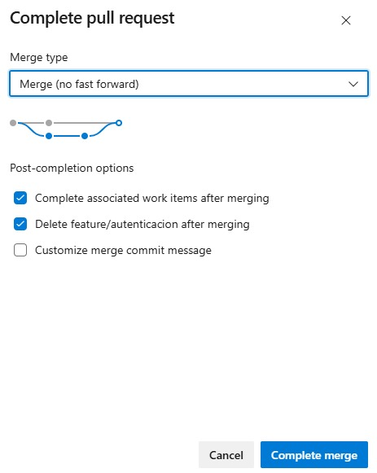

# Trabajo Práctico 3 - Introducción a Azure DevOps

Acceso al proyecto: https://dev.azure.com/joaquinmv03/GameTracker

---

## Configuración Inicial

Vamos a crear el proyecto en base a la idea de aplicación y el repositorio utilizado para el trabajo práctico N°2, llamado Game Tracker. 
La organización que utilizaremos y el proyecto a crear sera el siguiente: 

Ahora procedemos con la creación del proyecto: 

- Organización: **Joaquinmv03**  
- Proyecto: **GameTracker** 
- Visibility: **Private**
- Process: **Agile**

El work items process elegido fue el Agile. De esta forma, aseguramos que GameTracker evolucione de manera incremental. A su vez, cuenta con las siguientes características: 

- **Adaptabilidad al cambio:** los requisitos pueden evolucionar y Agile acepta el cambio como parte natural del proceso.
- **Enfoque en entregas de valor:** cada iteración produce un incremento útil y demostrable, se pueden ver avances y dar feedback de forma temprana.
- **Colaboración y visibilidad:** cuenta con tableros y reuniones periódicas, por lo que todo el equipo tiene visibilidad del estado del trabajo y puede comunicarse constantemente.
- **Priorización por valor de negocio:** se decide construir primero según el valor que aporta al usuario por lo que se trabaja primero en lo más crítico, asegurando que el producto sea funcional lo antes posible. 
- **Mejorar continua:** las retrospectivas permiten ajustar prácticas y procesos en cada ciclo.

Una vez creado el proyecto, procedemos a crear el equipo de trabajo, llamado GameTracker Devs. Posteriormente a esto, configuramos también las áreas del proyecto, en este caso serán dos áreas, Backend y Frontend, dentro del área raíz Gametracker.

--- 

## Azure Boards

Ya creado el proyecto, los equipos y las áreas, procedemos a crear una Epic. La mismo va a definir el propósito principal de GameTracker; que los usuarios puedan autenticarse, gestionar su biblioteca personal y compartir reseñas.

#### EPIC-1: Gestión de Biblioteca y Comunidad de Videojuegos

Una vez creada, procedemos a crear las Users Stories que van a estar relacionadas linkeada a esta. Estas US van a describir las funcionalidades desde la perspectiva del usuario final. Aparte de su descripción, también agregamos los criterios de aceptación, los cuales son condiciones que deben cumplirse para que la historia sea exitosa.

#### US-1: Registro e inicio de sesión de usuarios

Una vez creada la US se la asociamos a la Epic: 

#### US-2: Gestión de biblioteca personal

#### US-3: Sistema de reseñas y calificación

Quedando las 3 Users stories asociadas a la Epic: 

Ya creadas las historias de usuarios, procedemos a crear las Tasks correspondientes a cada una de ellas. Estas van a ser actividades técnicas necesarias para implementar nuestras US. 

#### Tasks

Para la US-1: Registro/Login

**T-1.1 Backend: Implementar endpoints de autenticación (registro/login con JWT).**
*Descripción:* Implementar en el backend los endpoints para registro e inicio de sesión de usuarios.
- POST /auth/register → debe crear usuario con email y password (validación de formato).
- POST /auth/login → debe devolver un JWT válido si las credenciales son correctas.
- Los usuarios deben guardarse en la base de datos MySQL.
- Usar librería estándar de Go para JWT y bcrypt para hashing de contraseñas.
*Área:* Backend

**T-1.2 Frontend: Crear formulario de registro/login con validación.**
*Descripción:* Diseñar y desarrollar formularios de registro e inicio de sesión en el frontend.
- Formulario de alta con email y password (validación de formato en el cliente).
- Formulario de login conectado al endpoint /auth/login.
- Guardar token JWT en localStorage tras login correcto.
- Mostrar mensajes de error en caso de credenciales inválidas.
*Área:* Frontend

Asociamos ambas Tasks a la US correspondiente: 

De la misma forma repetimos el proceso con las demas tareas correspondiente a cada US: 

Para la US-2: Biblioteca personal

**T-2.1 Backend: Implementar API /games (alta/listado/baja).**
*Descripción:* Desarrollar endpoints para la gestión de la biblioteca de juegos del usuario.
- POST /games → agregar un juego a la biblioteca.
- GET /games → listar los juegos guardados.
- DELETE /games/{id} → eliminar un juego de la biblioteca.
- Asociar cada juego al usuario autenticado mediante el JWT.
*Área:* Backend

**T-2.2 Frontend: Crear interfaz “Mi biblioteca” y conectar con API.** 
*Descripción:* Desarrollar la pantalla de biblioteca en el frontend que consuma la API /games.
- Formulario o botón para agregar un juego.
- Listado de juegos con opción de eliminar.
- Conectar acciones con el backend mediante fetch/axios.
- Mostrar mensajes de confirmación o error.
*Área:* Frontend

Para la US-3: Reseñas y calificación

**T-3.1 Backend: Implementar API /reviews (crear/listar + validación de rating).**
*Descripción:* Desarrollar endpoints para que los usuarios dejen reseñas y calificaciones de juegos.
- POST /reviews → agregar una reseña con comentario y puntaje (1-10).
- GET /reviews?gameId={id} → listar reseñas de un juego específico.
- Validar que el puntaje esté dentro del rango permitido (1-10).
- Asociar reseñas al usuario autenticado y al juego correspondiente.
*Área:* Backend

**T-3.2 Frontend: Crear pantalla de reseñas con sistema de puntuación y comentarios.**
*Descripción:* Desarrollar la pantalla de reseñas en el frontend que consuma la API /reviews.
- Formulario con campo de comentario y selección de puntaje (1-10).
- Mostrar listado de reseñas existentes para cada juego.
- Validar que el usuario esté autenticado para poder dejar reseñas.
- Mostrar mensajes de error si el puntaje no es válido o la API devuelve error.
*Área:* Frontend

Por último vamos a crear 2 Bugs de ejemplo. Estos van a representar errores detectados durante el desarrollo o pruebas.

#### BUG-1 (Frontend): validación de email incorrecta

#### BUG-2 (Backend): El endpoint /reviews permite valores de rating fuera de rango

#### Sprint

Una vez ya creados todos los Work Items, vamos a crear el Sprint: 

Y asociamos los Work Items al mismo: 

---

## Control de Versiones con Azure DevOps

En esta parte vamos a importar un repositorio: 

Quedando asi una vez importado: 

Ahora configuramos las políticas de branch para la rama principal, colocando las siguientes opciones: 
- Require a minimum number of reviewers → Establecemos como mínimo un reviewer.
- Check for linked work items → obliga a que los PR estén vinculados con una User Story/Task.
- Check for comment resolution → evita hacer merge si hay comentarios sin resolver en el PR.

Por otro lado, creamos las ramas para trabajar sobre el repo. En este caso serán dos ramas feature, una para la autenticación y otra para la biblioteca.

Para terminar, realizamos cambios y creamos una Pull Request de ejemplo. Primero hacemos un cambio en el README.md desde la rama feature/autenticacion para simular un cambio, y posteriormente hacemos el commit: 

Posteriormente creamos la Pull Request para el cambio anteriormente realizado: 

Por último, aprobamos la PR y realizamos el merge: 

---

## Problemas encontrados y soluciones aplicadas

Uno de los problemas surgidos fue que a la hora de realizar el commit, nos olvidamos de asignarle un Work Item al mismo. Esto provocó que a la hora de ver la PR, no nos permita aceptarla debido a que no se cumplian las politicas de ramas, especificamente: 
- Check for linked work items → obliga a que los PR estén vinculados con una User Story/Task.

Para solucionar esto, tuvimos que abandonar la PR y crear una nueva, asignandole un Work Item al commit realizado. 

Otro de los problemas que encontramos fue que cuando marcamos la opción de *Require a minimum number of reviewers*, no marcamos que el usuario que cree la PR pueda aprobarla también. Azure al no permitir que la organización posea mas miembros, nos obligó a volver a la configuración de políticas y marcar la opción que permite aprobar una PR al usuario que la realiza. De esta manera lo pudimos hacer y probar como funciona el merge una vez aceptada una PR. 