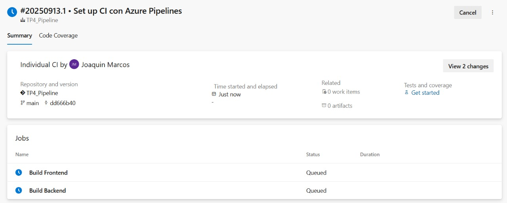

# Trabajo Práctico 4 - Azure DevOps Pipelines

- Acceso al proyecto: https://dev.azure.com/joaquinmv03/TP4_Pipeline

--- 

## Preparación del entorno

Como primer paso lo que hicimos fue crear una Pool y un Agente Self‑Hosted en ADO. 
Creamos una pool, es decir, un contenedor lógico donde se registran los agentes que pueden ejecutar los pipelines. En este caso, nuestra pool va a ser llamada MiPool: 

Una vez creada la pool, procedimos a registrar un Agente Self-Hosted.
Un agente es el software que se instalamos en nuestra máquina y es el encargado de ejecutar las instrucciones del pipeline.
Previamente a la creación del agent, pedimos un token de acceso generado para la posterior configuración: 

Luego descargamos el paquete del agente desde Azure DevOps y lo descomprimimos en una carpeta unica para el agent. Posteriormente realizamos su configuracion posicionados en la carpeta con el comando .\config.cmd: 

Una vez terminada la configuración, verificamos: 

---

## Estructura del repo y definición del pipeline

Como definimos anteriormente, el proyecto esta organizado en dos carpetas principales: 
- /frontend/gameTracker 
- /back 

Para la creacion del pipeline, primero importamos el repositorio: 

Una vez ya obtenido el proyecto: 

Procedemos a crear el pipeline desde cero. Para ello vamos a agregar azure-pipelines.yml en raíz: 

Para la estructura del mismo, tenemos en cuenta el siguiente YAML requerido (multi‑stage):
- Trigger: en main.

Stage CI dividido en dos jobs:
- Job Frontend → instala dependencias, corre build, publica dist.
- Job Backend → instala dependencias, compila binario, publica bin/.

- Publicación de artefactos: cada build deja artefactos listos para pruebas/despliegue.

---

## Problemas encontrados y soluciones aplicadas

Luego de crear el primer pipeline, tuvimos cierto errores: 

**Error en backend: descarga fallida de Go 1.22.x**

En el primer pipeline creado el paso Use Go 1.22.x arrojaba error 404 al intentar descargar la versión.
Como solución, se ajustó la configuración para usar la versión exacta instalada en el agente (1.22.1), lo que permitió compilar correctamente el backend.

**Error en frontend: carpeta dist no encontrada**

Tambien uno de los problemas fue que el pipeline intentaba publicar artefactos de frontend/gameTracker/dist, pero esa carpeta no se generaba. En este caso, como solución, se corrigió el paso de build para ejecutar npm run build en la ruta correcta y se agregó un paso de verificación para validar la existencia de la carpeta.

**Problema en el build del frontend con Vite**

Por ultimo, otro de los problemas fue que el build fallaba porque el script en package.json contenía un argumento inválido 
Como solución, se corrigió el script de build para dejarlo en vite build, logrando que el proceso compile correctamente y genere los archivos de distribución.

Luego de varios intentos y hacer las correciones pertinentes, el pipeline final quedo de la siguiente manera: 

trigger:
  branches:
    include: [ main ]

stages:
- stage: CI
  displayName: "CI"
  jobs:

  #### FRONTEND
  - job: Front
    displayName: "Build Frontend"
    pool: { name: MiPool }
    steps:
      - checkout: self
      - task: CmdLine@2
        displayName: "npm ci"
        inputs:
          script: npm ci
          workingDirectory: '$(Build.SourcesDirectory)/frontend/gameTracker'
      - task: CmdLine@2
        displayName: "npm run build"
        inputs:
          script: npm run build
          workingDirectory: '$(Build.SourcesDirectory)/frontend/gameTracker'
      - task: PublishBuildArtifacts@1
        displayName: "Publish front (dist)"
        inputs:
          PathtoPublish: '$(Build.SourcesDirectory)/frontend/gameTracker/dist'
          ArtifactName: 'front_dist'

  #### BACKEND
  - job: Back
    displayName: "Build Backend"
    pool: { name: MiPool }
    steps:
      - checkout: self
      - task: CmdLine@2
        displayName: "go tidy + test"
        inputs:
          script: |
            cd backend
            go mod tidy
            go test ./... -v
      - task: CmdLine@2
        displayName: "go build"
        inputs:
          script: |
            cd backend
            mkdir -p bin
            go build -o bin/app.exe .
      - task: PublishBuildArtifacts@1
        displayName: "Publish back (bin)"
        inputs:
          PathtoPublish: 'backend/bin'
          ArtifactName: 'back_bin'

---

## Evidencias y prueba final

Con el pipeline ya funcionando: 

Editamos el repositorio para poder probar que el pipeline funcione, una vez realizado y pusheado algun cambio al proyecto. Para esto, modificamos el README.md dentro de frontend/gametracker simulando un cambio y los pusheamos. 

Luego de esto, corroboramos que el pipeline se haya activado y funcionado:

Por ultimo, verificamos que los artefactos se hayan creado: 

