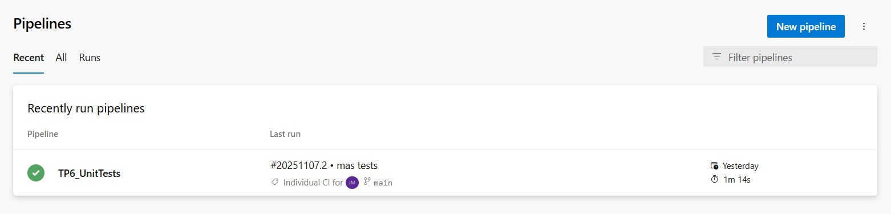
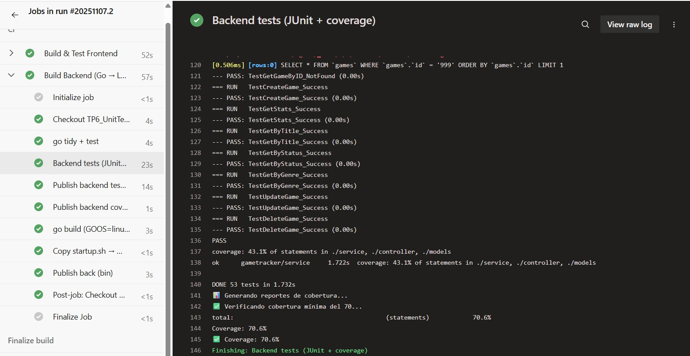
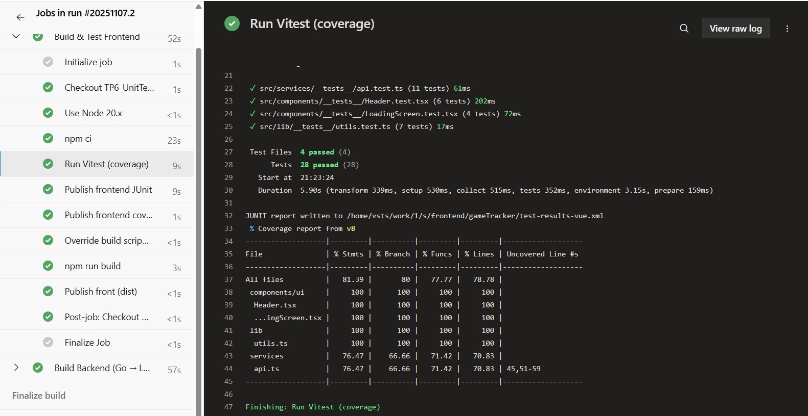
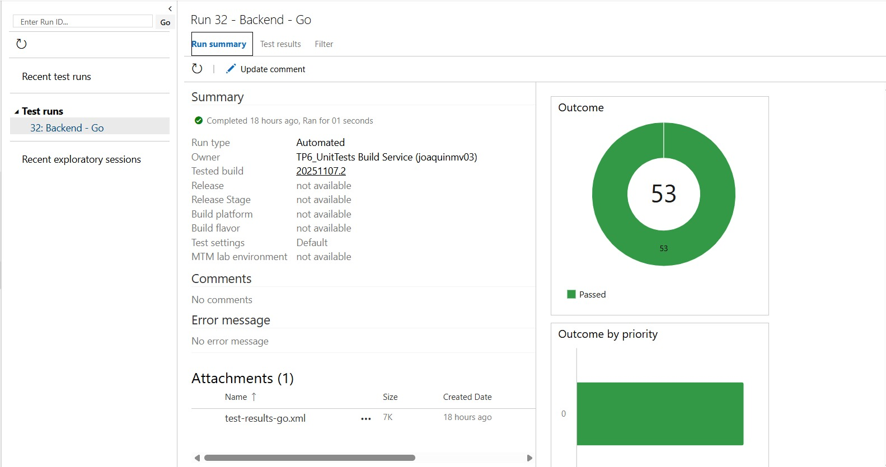
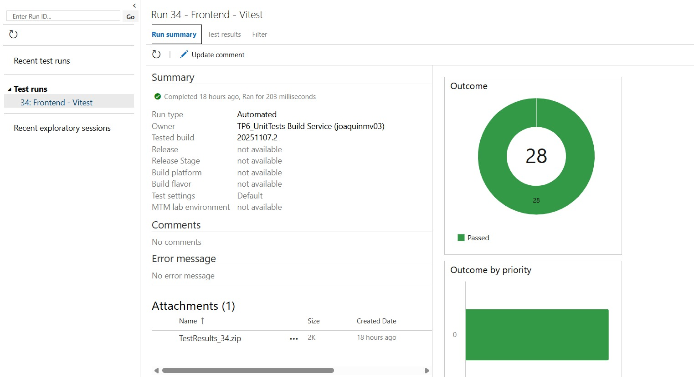
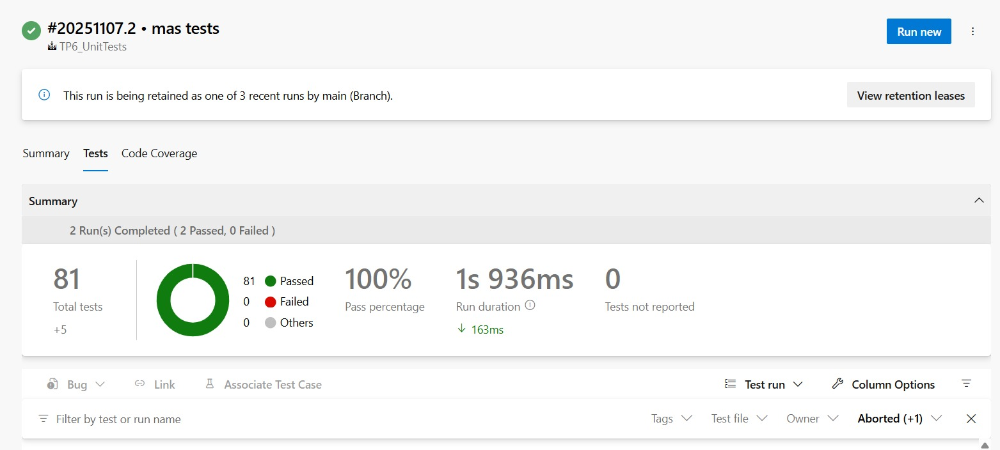

# Trabajo Práctico 6 - Pruebas Unitarias

## Acceso al proyecto

- Organización: **Joaquinmv03**  
- Proyecto: **TP6_UnitTests**  
- URL: https://dev.azure.com/joaquinmv03/TP6_UnitTests

La aplicación cuenta frontend en React + TypeScript + Vite y backend en Go.

---

## Setup de Testing

El proyecto **GameTracker** implementa un entorno de pruebas unitarias completo para backend y frontend, garantizando **calidad, mantenibilidad y control de regresiones**.

### Frameworks y Herramientas

#### Backend (Go)

| Herramienta         | Función                     | Justificación                                                |
| ------------------- | --------------------------- | ------------------------------------------------------------ |
| **go test**         | Framework nativo de testing | Ligero y compatible con todas las versiones de Go            |
| **testify**         | Assertions y mocks legibles | Mejora la legibilidad de los tests y simplifica validaciones |
| **sqlmock**         | Simulación de base de datos | Permite pruebas aisladas sin requerir una DB real            |
| **gotestsum**       | Ejecutor con reportes JUnit | Integración directa con CI/CD                                |
| **go-junit-report** | Conversión a XML            | Compatible con reportes automatizados de CI                  |

#### Frontend (React/TypeScript)

| Herramienta                   | Función                       | Justificación                                               |
| ----------------------------- | ----------------------------- | ----------------------------------------------------------- |
| **Vitest**                    | Framework moderno de pruebas  | Más rápido y ligero que Jest, ideal para proyectos con Vite |
| **@testing-library/react**    | Testing de componentes        | Centrado en comportamiento del usuario final                |
| **@testing-library/jest-dom** | Matchers adicionales          | Facilita validaciones sobre el DOM                          |
| **jsdom**                     | Entorno simulado de navegador | Permite ejecutar tests sin browser real                     |
| **@vitest/coverage-v8**       | Cobertura de código           | Genera reportes HTML, LCOV y Cobertura XML                  |

Todos los frameworks generan resultados en formato **JUnit XML y HTML**, compatibles con pipelines de integración continua.

---

## Pruebas Backend

Las pruebas unitarias cubren la **lógica de negocio**, los **servicios** y los **controladores** principales del backend.  
Se aplicó el patrón **AAA (Arrange, Act, Assert)** para garantizar claridad y mantenibilidad.

### Servicios Probados

**Archivo:** `service/service_test.go`

- `GetAllGames()` → Obtener todos los juegos  
- `GetGameByID()` → Búsqueda por ID (casos exitoso y error)  
- `CreateGame()` → Creación de nuevo juego, validación de duplicados  
- `UpdateGame()` → Actualización de registros  
- `DeleteGame()` → Eliminación de juegos  
- `GetByTitle()`, `GetByStatus()`, `GetByGenre()` → Filtros de búsqueda  
- `GetStats()` → Generación de estadísticas globales  

### Controladores Probados

**Archivo:** `controller/controller_test.go`

- Validación de endpoints REST (GET, POST, PUT, DELETE)  
- Comprobación de status codes esperados  
- Simulación de errores de servicio (400, 404, 500)

---

## Pruebas Frontend

Las pruebas del frontend cubren componentes React, servicios y utilidades.
El objetivo principal fue validar renderización, comportamiento e interacción del usuario.

### Componentes Probados

- `Header.test.tsx` → Renderizado con usuario autenticado y logout
- `LoadingScreen.test.tsx` → Estado visual de carga
- `GameCard.test.tsx` → Validación de props y render dinámico

### Servicios y Utilidades

- `api.test.ts` → Mock de endpoints (GET, POST, PUT, DELETE)
- `auth.test.ts` → Login, register y profile con tokens
- `utils.test.ts` → Pruebas sobre cn() (merge de clases CSS)

Las pruebas se ejecutan con Vitest y generan reportes en /coverage.

---

## Mocking y Aislamiento
### Backend
Se utilizo sqlmock para reemplazar la conexión real a la base de datos, donde cada test crea su propio entorno in-memory:
```go
db, mock := sqlmock.New()
mock.ExpectQuery("SELECT").WillReturnRows(sqlmock.NewRows(...))
```
Esto garantiza independencia total de infraestructura externa.

### Frontend

Uso de vi.mock() (Vitest) para interceptar módulos o servicios:
```typescript
vi.mock('@/services/api', () => ({
  getGames: vi.fn().mockResolvedValue(mockGames),
}))
```
jsdom simula el entorno del navegador, permitiendo ejecutar pruebas sin abrir un browser real.
Hooks (useAuth, useGameService) y servicios HTTP son mockeados para evitar llamadas reales.

- Resultado: todos los tests son determinísticos y reproducibles.

---

## Integración CI/CD (Azure DevOps)

El pipeline de Integración Continua (CI) se implementó en Azure DevOps: 
```yaml
trigger:
  branches:
    include: [ main ]

# ===== Variables =====
variables:
  azureSubscription: 'azure-tp05-connection'

  # Web Apps (no usadas en esta etapa de CI, pero las dejo)
  qaWebAppBack:  'webapp-tp05-back-QA'
  qaWebAppFront: 'webapp-tp05-front-QA'
  prodWebAppBack:  'webapp-tp05-back-PROD'
  prodWebAppFront: 'webapp-tp05-front-PROD'

stages:
# ============================================================
# =                          CI                             =
# ============================================================
- stage: CI
  displayName: "CI"
  jobs:

  # ---------- FRONTEND ----------
  - job: Front
    displayName: "Build & Test Frontend"
    pool:
      vmImage: 'ubuntu-latest'
    steps:
      - checkout: self

      - task: NodeTool@0
        displayName: "Use Node 20.x"
        inputs:
          versionSpec: '20.x'

      - task: CmdLine@2
        displayName: "npm ci"
        inputs:
          script: npm ci
          workingDirectory: '$(Build.SourcesDirectory)/frontend/gameTracker'

      # Tests: Vitest con coverage (esto ya te venía funcionando)
      - task: CmdLine@2
        displayName: "Run Vitest (coverage)"
        inputs:
          script: npm run coverage
          workingDirectory: '$(Build.SourcesDirectory)/frontend/gameTracker'

      - task: PublishTestResults@2
        displayName: "Publish frontend JUnit"
        inputs:
          testResultsFormat: 'JUnit'
          testResultsFiles: '**/test-results-*.xml'
          searchFolder: '$(Build.SourcesDirectory)/frontend/gameTracker'
          testRunTitle: 'Frontend - Vitest'
          mergeTestResults: true
        condition: always()

      - task: PublishBuildArtifacts@1
        displayName: "Publish frontend coverage artifact"
        inputs:
          PathtoPublish: '$(Build.SourcesDirectory)/frontend/gameTracker/coverage'
          ArtifactName: 'front_coverage'
        condition: always()

      # Override temporal del script de build: tsc -b -> SOLO vite build
      - task: CmdLine@2
        displayName: "Override build script to 'vite build' (CI-only)"
        inputs:
          script: npm pkg set scripts.build="vite build"
          workingDirectory: '$(Build.SourcesDirectory)/frontend/gameTracker'

      # Build del front (ahora sin type-check)
      - task: CmdLine@2
        displayName: "npm run build"
        inputs:
          script: npm run build
          workingDirectory: '$(Build.SourcesDirectory)/frontend/gameTracker'

      - task: PublishBuildArtifacts@1
        displayName: "Publish front (dist)"
        inputs:
          PathtoPublish: '$(Build.SourcesDirectory)/frontend/gameTracker/dist'
          ArtifactName: 'front_dist'

  # ---------- BACKEND ----------
  - job: Back
    displayName: "Build Backend (Go → Linux)"
    pool: { name: MiPool }
    steps:
      - checkout: self

      - task: CmdLine@2
        displayName: "go tidy + test"
        inputs:
          script: |
            cd backend
            go mod tidy
            go test ./... -v

      # ------------------- ADD: BACKEND TESTS --------------------
      # Usa tu script si existe (Windows agent) o ejecuta fallback gotestsum
      - task: CmdLine@2
        displayName: "Backend tests (JUnit + coverage)"
        inputs:
          script: |
            cd backend
            if exist run-tests.bat (
              call run-tests.bat
            ) else (
              echo Running fallback: gotestsum + coverage
              go install gotest.tools/gotestsum@latest
              go install github.com/jstemmer/go-junit-report/v2@latest
              %GOBIN%\gotestsum --version || gotestsum --version
              gotestsum --format=standard-verbose --junitfile test-results-go.xml -- ^
                -covermode=atomic -coverprofile=coverage.out ./...
              go tool cover -html=coverage.out -o coverage.html
              go tool cover -func=coverage.out > coverage.txt
            )

      - task: PublishTestResults@2
        displayName: "Publish backend test results (JUnit)"
        inputs:
          testResultsFormat: JUnit
          testResultsFiles: 'test-results-go.xml'
          searchFolder: '$(Build.SourcesDirectory)/backend'
          testRunTitle: 'Backend - Go'
          failTaskOnFailedTests: true

      # (Opcional) Publicar cobertura HTML como artefacto (Go genera coverage.html)
      - task: PublishBuildArtifacts@1
        displayName: "Publish backend coverage (HTML)"
        inputs:
          PathtoPublish: '$(Build.SourcesDirectory)/backend/coverage.html'
          ArtifactName: 'back_coverage_html'
          publishLocation: 'Container'
      # ----------------- /ADD: BACKEND TESTS ---------------------

      - task: CmdLine@2
        displayName: "go build (GOOS=linux GOARCH=amd64 CGO=0)"
        inputs:
          script: |
            cd backend
            mkdir -p bin
            set GOOS=linux
            set GOARCH=amd64
            set CGO_ENABLED=0
            go build -o bin/server -ldflags="-s -w" .

      - task: CmdLine@2
        displayName: "Copy startup.sh → bin/"
        inputs:
          script: |
            cd backend
            copy startup.sh bin\startup.sh

      - task: PublishBuildArtifacts@1
        displayName: "Publish back (bin)"
        inputs:
          PathtoPublish: 'backend/bin'
          ArtifactName: 'back_bin'
```

### Estructura General
El pipeline se ejecuta automáticamente sobre la rama main tras cada push o merge, e incluye una única etapa con dos jobs:

#### Job: Frontend

- Instala Node.js 20.x
- Ejecuta npm ci (instalación limpia y reproducible)
- Corre los tests unitarios con npm run coverage
- Genera reportes JUnit + Cobertura
- Compila con npm run build y publica artefacto front_dist

### Job: Backend

- Instala Go 1.22.x
- Ejecuta go mod tidy
- Corre tests con gotestsum y cobertura con go test
- Genera reportes JUnit + Cobertura
- Compila binario server para linux/amd64 y publica artefacto back_bin

### Política de Calidad

El pipeline falla automáticamente si la cobertura < 70%.
Todos los reportes y artefactos quedan disponibles para revisión en Azure DevOps.
Se prioriza la reproducibilidad, osea que cada ejecución corre en un entorno limpio y aislado.



---

## Resultados de Ejecución
### Backend (Go)
Métrica	Resultado
Tests ejecutados	53
Tests aprobados	53 / 53 ✅
Cobertura total =	70.6%
Cobertura mínima requerida = 70%
Estado del pipeline	✅ Passed

- Paquetes incluidos: service, controller, models.




### Frontend (React / TypeScript)
Métrica	Resultado
Test files	4
Tests ejecutados	28
Tests aprobados	28 / 28 ✅
Cobertura global	81.39% statements / 80% branches / 78.78% lines

Los tests cubren componentes, servicios API y funciones utilitarias.



---

## Evidencias
### Backend

- backend/test-results-go.xml → Reporte JUnit
- backend/coverage.xml → Reporte Cobertura
- backend/coverage.html → Visualización interactiva de cobertura



Pipeline log:
✅ Coverage: 70.6%
All tests passed (53/53)

### Frontend

- frontend/gameTracker/test-results-vue.xml → Reporte JUnit
- frontend/gameTracker/coverage/index.html → Detalle de cobertura global



Pipeline log:

Tests 28 passed (28)
Coverage 81.39% statements
✅ Passed coverage threshold (70%)


### Resultado General


