# Trabajo Práctico 7 - Pruebas de Integracion y Code Coverage

## Acceso al proyecto

- Organización: **Joaquinmv03**  
- Proyecto: **TP7_IntegrationTests**  
- URL: https://dev.azure.com/joaquinmv03/TP7_IntegrationTests

La aplicación cuenta frontend en React + TypeScript + Vite y backend en Go.

--- 

## Setup de Code Coverage

### Backend

El backend poseia los tests en Go y un archivo de cobertura (backend/coverage) generado localmente con go test. En el repo se encontraba un archivo backend/coverage con formato mode: atomic y métricas por archivo/linea.

Lo que hicimos fue estandarizar la forma de correr tests con cobertura mediante un script en el job de backend. Con esto conseguimos:

- coverage.out → cobertura en formato estándar de Go.
- coverage.html → reporte visual por línea.
- coverage.txt → resumen de funciones.
- test-results-go.xml → JUnit para Azure DevOps.

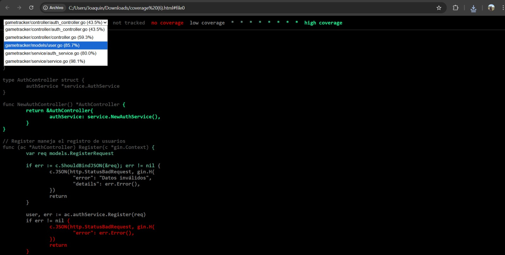

### Frontend

El frontend ya tenía pruebas con Vitest, peor no se estaba ejecutando coverage en el pipeline. No había reportes en formato consumible por Azure entonces lo que hicimos fue agregar y ajustar el script de coverage en package.json del front:
```json
{
  "scripts": {
    "coverage": "vitest run --coverage"
  }
}
```

Configuramos Vitest para que genere reportes en formatos estándar:

- cobertura → para Azure DevOps.
- Report directory: frontend/gameTracker/coverage.

En el pipeline, añadimos el paso y publicamos el coverage del frontend en la pestaña Code Coverage de Azure:

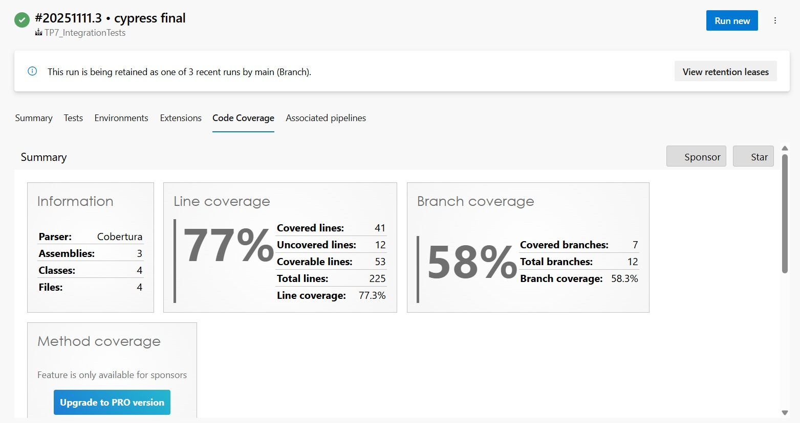
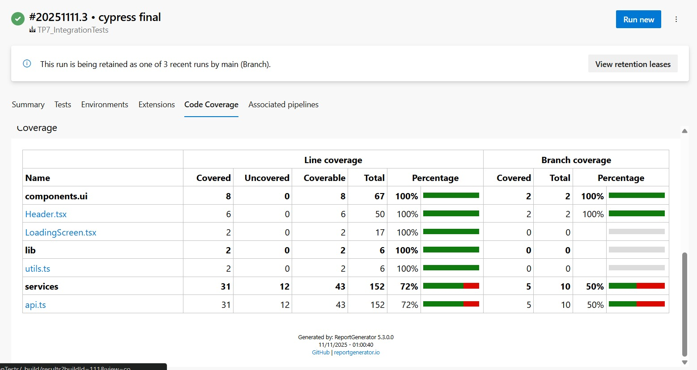

---

## Configuración SonarCloud

### Creación y configuración del proyecto en SonarCloud

Se creó una organización personal en SonarCloud: joaquinmv03.
Dentro de esa organización se dio de alta el proyecto y se asocio al proyecto TP7_IntegrationTests de azure:

- Key: sonarqubeProjectKey
- Nombre: TP7_IntegrationTests
- Lenguajes detectados: TypeScript, JavaScript, Go, CSS, Shell, Docker, etc.

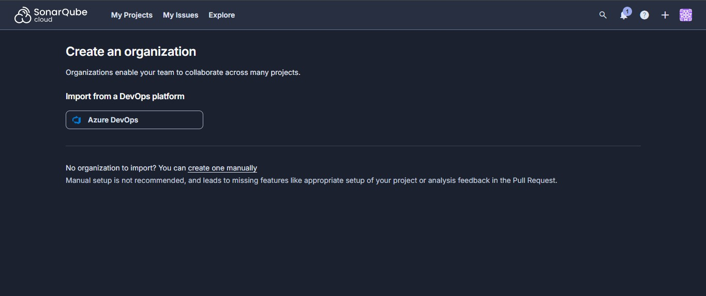
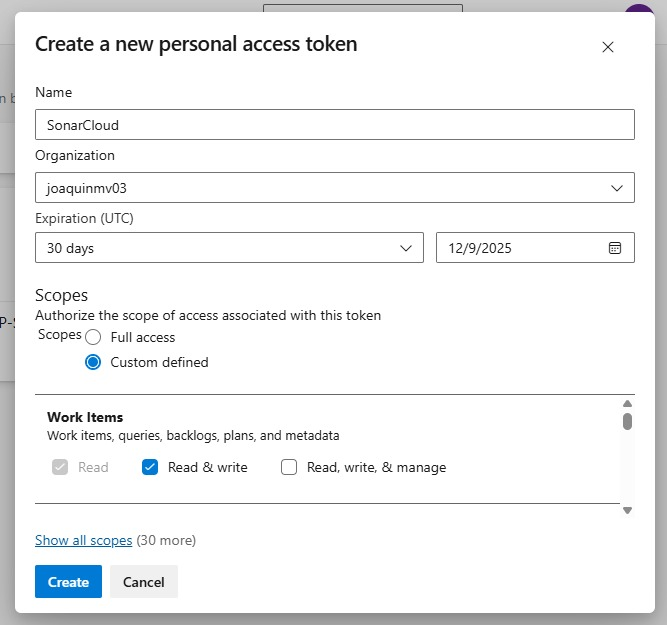
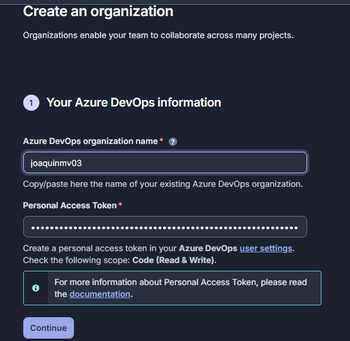
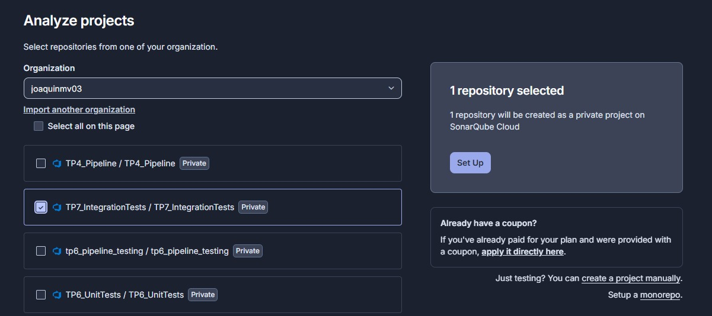
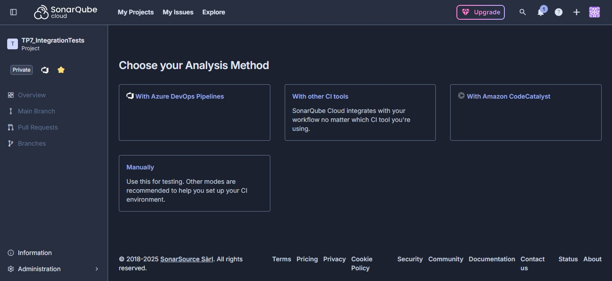

Se instalos la extension de SonarQube Cloud en Microsoft: 

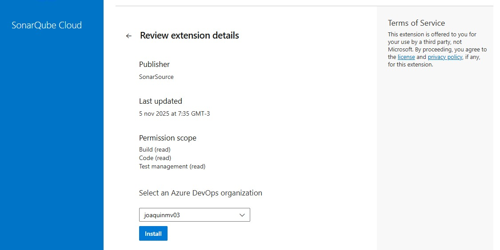

Posteriormente en Azure DevOps configurar un Service Connection de tipo SonarQube Cloud con el fin de poder usarlo en el pipeline:

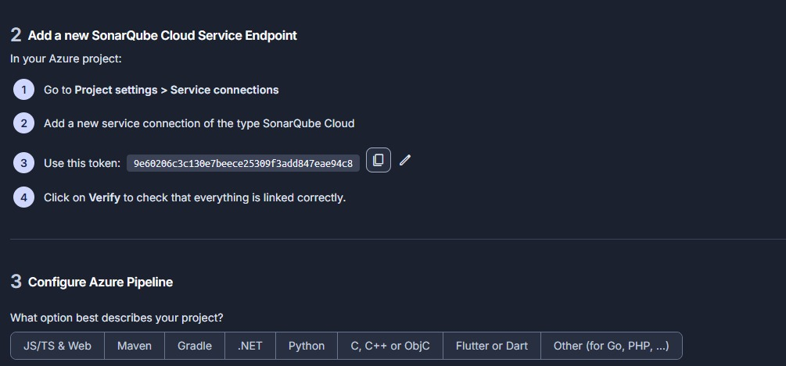

- Nombre: SonarQube-Cloud-connection
- Asociado a la organización joaquinmv03.
- Permite que los pipelines usen el token de Sonar sin exponerlo en el YAML.
- Configuración de análisis en el repo

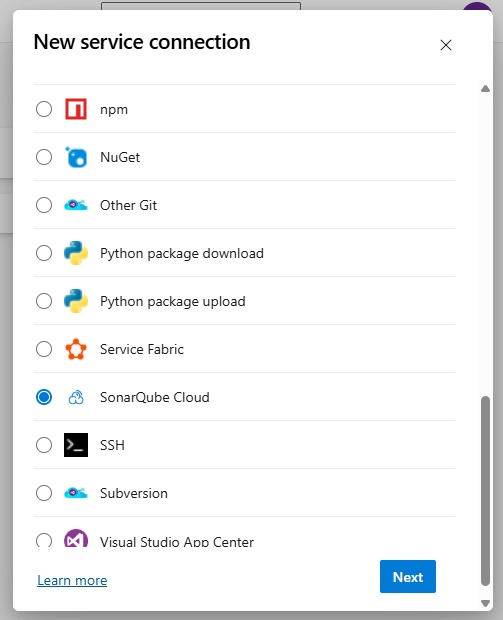
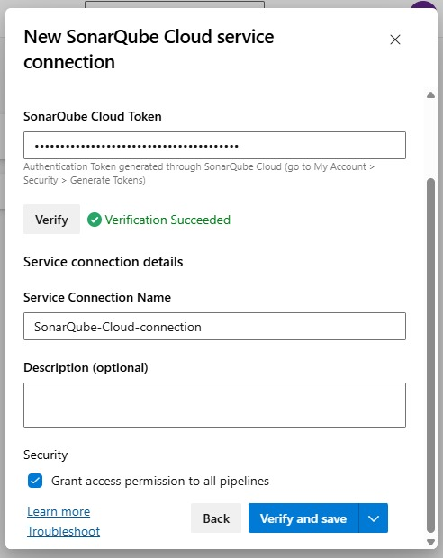
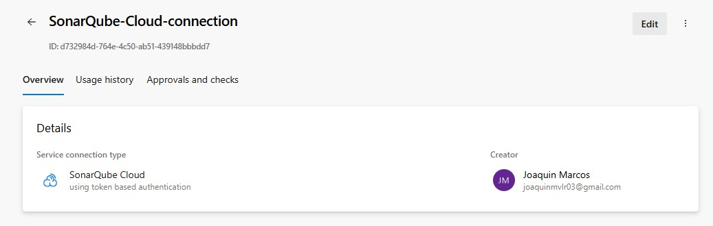

### Preparación del entorno

Antes de poder ejecutar el análisis de SonarCloud desde el agente self-hosted, fue necesario instalar y configurar manualmente Java 17, ya que el escáner de SonarCloud requiere un entorno Java configurado correctamente.

Se descargó la versión Eclipse Adoptium Temurin 17 (HotSpot) desde la web oficial y creamos una variable de entorno:

- Nombre: JAVA_HOME_17_X64
- Valor:C:\Program Files\Eclipse Adoptium\jdk-17.0.12-hotspot

Para Verificar que todo se haya realizado bien se ejecuto lo siguiente en terminal:
```bash
echo %JAVA_HOME_17_X64%
dir "%JAVA_HOME_17_X64%\bin"
java -version
```
Resultado:
```bash

openjdk version "17.0.12" 2024-07-16 LTS
OpenJDK Runtime Environment Temurin-17.0.12+7
```

### Implementación de SonarCloud

En la raíz del repositorio se agregó el archivo sonar-project.properties con la configuración común para back y front:
```properties
sonar.projectKey=sonarqubeProjectKey
sonar.organization=joaquinmv03

sonar.projectName=TP7_IntegrationTests
sonar.projectVersion=1.0
sonar.sourceEncoding=UTF-8

# Go del backend + TS/JS del frontend (solo src)
sonar.sources=backend,frontend/gameTracker/src

# Tests del frontend (para que no cuenten como "source")
sonar.tests=frontend/gameTracker/src
sonar.test.inclusions=**/*.test.ts,**/*.spec.ts

# Exclusiones de código que no se deben analizar
sonar.exclusions=**/node_modules/**,**/dist/**,**/coverage/**,frontend/gameTracker/cypress/**

# Coverage backend (Go)
sonar.go.coverage.reportPaths=backend/coverage,backend/coverage.out

# Coverage frontend (Vitest)
sonar.javascript.lcov.reportPaths=frontend/gameTracker/coverage/lcov.info
sonar.typescript.lcov.reportPaths=frontend/gameTracker/coverage/lcov.info
```

Con esto SonarCloud:

- Analiza código del backend y frontend.
- Ignora node_modules, dist, coverage y los tests E2E de Cypress.
- Combina la cobertura de Go + Vitest en una única métrica de cobertura.

### Integración de SonarCloud en el pipeline

La integración se hizo en el job Back del stage de CI, usando las tareas oficiales de la extensión de SonarCloud para Azure Pipelines.

```yaml
# Checkout con todo el historial (necesario para blame / new code)
- checkout: self
  fetchDepth: 0

# ===== SonarQube Cloud - PREPARE =====
- task: SonarCloudPrepare@3
  displayName: 'Prepare SonarQube Cloud analysis'
  inputs:
    SonarCloud: '$(sonarqubeServiceConnection)'
    organization: 'joaquinmv03'
    scannerMode: 'CLI'
    configMode: 'file'          # lee sonar-project.properties
    projectKey: '$(sonarqubeProjectKey)'

# ... tests de Go + coverage ...

# ===== SonarQube Cloud - ANALYZE =====
- task: SonarCloudAnalyze@3
  displayName: 'Run SonarQube Cloud analysis'
  inputs:
    jdkversion: 'JAVA_HOME_17_X64'

# ===== SonarQube Cloud - QUALITY GATE =====
- task: SonarCloudPublish@3
  displayName: 'Publish SonarQube Cloud Quality Gate'
  inputs:
    pollingTimeoutSec: '300'
```

Lo que realiza esto es: 
- SonarCloudPrepare inicializa el análisis y carga la config del sonar-project.properties.
- Se ejecutan tests + coverage del backend (Go).
- SonarCloudAnalyze lanza el escaneo estático utilizando la CLI de Sonar.
- SonarCloudPublish consulta el estado del Quality Gate y lo reporta en el run de Azure DevOps.

En ese sentido, si el análisis falla o la tarea de Publish no puede recuperar el Quality Gate, el job Back se marca como fallido, lo que a su vez bloquea los stages posteriores (Deploy QA, E2E QA y Deploy PROD), cumpliendo el rol de “quality gate” en CI/CD.

--- 

## Implementación Cypress

### Instalación y configuración de Cypress

Las pruebas de integración/end-to-end se implementaron con Cypress, ejecutándose contra el entorno de QA.

En el frontend (frontend/gameTracker) se hizo:

- npm install --save-dev cypress

Luego se inicializó Cypress:

- npx cypress open

Esto generó la estructura estándar:

- **cypress/e2e/ →** specs E2E
- **cypress/fixtures/ →** datos de prueba
- **cypress/support/ →** configuración y hooks compartidos

Realizamos la configuración principal en cypress.config.ts:

- Usar baseUrl apuntando al FRONT de QA para que todos los se ejecuten contra el entorno desplegado en la nube. 
- Ejecutar en modo headless en el pipeline.
- Habilitar screenshotOnRunFailure para generar evidencia automática cuando un test falla.

## Casos de prueba de integración implementados

En la carpeta cypress/e2e/ se implementaron los siguientes flujos E2E:

- **Login exitoso →** login.cy.ts
- **Registro de usuario nuevo →** register.cy.ts
- **Creación de juego →** create-game.cy.ts
- **Edición de juego →** edit-game.cy.ts
- **Eliminación de juego →** delete-game.cy.ts

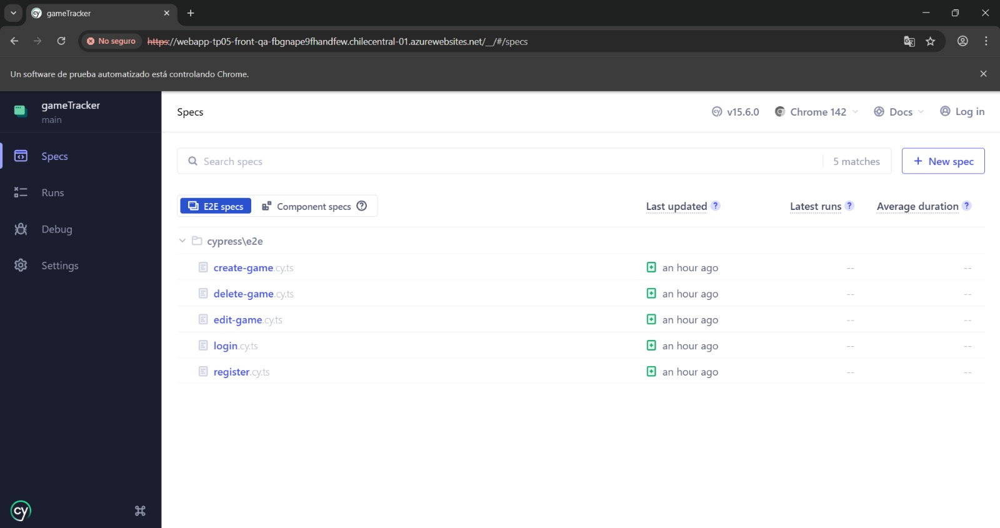

### Flujo de creación de un registro

**Archivo:** cypress/e2e/create-game.cy.ts
**Objetivo:** validar el flujo completo desde login hasta creación de un juego y su visualización en la lista.


### Flujo de actualización de un registro

**Archivo:** cypress/e2e/edit-game.cy.ts
**Objetivo:** probar que un juego existente puede ser editado exitosamente.


### Flujo de eliminación de un registro

**Archivo:** cypress/e2e/delete-game.cy.ts
**Objetivo:** asegurar que la eliminación de un juego borra el registro de la base y de la UI.

### Ejemplo

```typescript
// cypress/e2e/create-game.cy.ts

describe('Crear juego', () => {
  const email = 'joaquin_test@gmail.com';
  const password = 'password123';

  it('permite crear un juego nuevo', () => {
    cy.visit('/');

    // Login
    cy.get('input[placeholder="Ingresa tu usuario o email"]').type(email);
    cy.get('input[placeholder="Ingresa tu contraseña"]').type(password);
    cy.contains('button', 'Iniciar Sesión').click();

    cy.contains('h2', 'Agregar Juego').should('be.visible');

    // Crear juego
    const titulo = `Juego Cypress ${Date.now()}`;

    cy.get('input[placeholder="Título"]').type(titulo);
    cy.get('input[placeholder="Plataforma"]').type('PC');
    cy.get('input[placeholder="Género"]').type('Acción');
    cy.get('textarea[placeholder="Nota personal"]').type(
      'Juego creado automáticamente por Cypress'
    );

    cy.contains('button', 'Guardar').click();

    cy.contains(titulo).should('exist');
  });
});
```

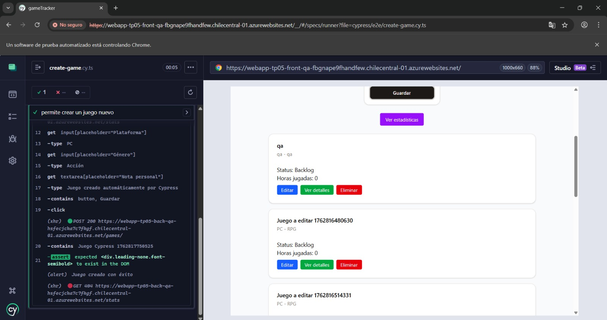

---

## Integración en el Pipeline CI/CD y Quality Gates

El pipeline de Azure DevOps quedó organizado en 4 stages encadenados, todos definidos en azure-pipeline.yml:

### CI

- Build + tests + coverage del frontend (Vitest).
- Build + tests + coverage del backend (Go).
- Análisis estático con SonarQube Cloud (SonarCloud).
- Publicación de resultados (Code Coverage, JUnit, artifacts).

### DeployQA

- Toma los artifacts de CI (back_bin, front_dist).
- Empaqueta y deploya el backend Go en WebApp QA.
- Deploya el frontend (dist de Vite) en WebApp QA.
- Ejecuta health checks sobre /health (back) y / (front).

### E2E_QA (Cypress)

- Ejecuta Cypress E2E headless contra QA.
- Si falla algún test, falla el stage.

### DeployPROD

- Solo se ejecuta si todos los stages anteriores terminaron en éxito.
- Reutiliza los artifacts de CI para deployar en WebApps de PROD.
- Ejecuta nuevamente health checks en back y front productivos.

Las dependencias se manejan con dependsOn + condition:
```yaml
- stage: DeployQA
  dependsOn: CI
  condition: and(succeeded(), eq(variables['Build.SourceBranch'], 'refs/heads/main'))

- stage: E2E_QA
  dependsOn: DeployQA
  condition: and(succeeded(), eq(variables['Build.SourceBranch'], 'refs/heads/main'))

- stage: DeployPROD
  dependsOn: E2E_QA
  condition: and(succeeded(), eq(variables['Build.SourceBranch'], 'refs/heads/main'))
```
Esto garantiza que si algo falla en CI o en E2E_QA, el deploy a PROD no ocurre.

### Integración de coverage en el pipeline

#### Frontend – en el job Front:

Se ejecuta npm run coverage en frontend/gameTracker.
Vitest genera reportes en frontend/gameTracker/coverage, incluyendo cobertura-coverage.xml y lcov.info.

Se publica coverage en Azure DevOps:
```yaml
- task: PublishCodeCoverageResults@2
  displayName: "Publicar code coverage frontend (Vitest)"
  condition: always()
  inputs:
    codeCoverageTool: 'Cobertura'
    summaryFileLocation: '$(Build.SourcesDirectory)/frontend/gameTracker/coverage/cobertura-coverage.xml'
    reportDirectory: '$(Build.SourcesDirectory)/frontend/gameTracker/coverage'
    failIfCoverageEmpty: false
```
Se publica también el folder completo como artifact:
```yaml
- task: PublishBuildArtifacts@1
  displayName: "Publish frontend coverage artifact"
  inputs:
    PathtoPublish: '$(Build.SourcesDirectory)/frontend/gameTracker/coverage'
    ArtifactName: 'front_coverage'
  condition: always()
```

#### Backend – en el job Back:

Se ejecutan tests con coverage y JUnit (usando gotestsum y go tool cover), generando:

- backend/coverage.out
- backend/coverage.html
- backend/coverage.txt
- backend/test-results-go.xml

Se publican resultados de tests:
```yaml
- task: PublishTestResults@2
  displayName: "Publish backend test results (JUnit)"
  inputs:
    testResultsFormat: JUnit
    testResultsFiles: 'test-results-go.xml'
    searchFolder: '$(Build.SourcesDirectory)/backend'
    testRunTitle: 'Backend - Go'
    failTaskOnFailedTests: true
```

Se publica el HTML de coverage como artifact descargable:
```yaml
- task: PublishBuildArtifacts@1
  displayName: "Publish backend coverage (HTML)"
  inputs:
    PathtoPublish: '$(Build.SourcesDirectory)/backend/coverage.html'
    ArtifactName: 'back_coverage_html'
    publishLocation: 'Container'
```

Con esto, en la pestaña Code Coverage de Azure DevOps se ve la cobertura del frontend; y el backend expone un HTML navegable como artifact.

### Integración de SonarQube Cloud

La integración con SonarQube Cloud se hace en el job Back del stage CI:
```yaml
- task: SonarCloudPrepare@3
  displayName: 'Prepare SonarQube Cloud analysis'
  inputs:
    SonarCloud: '$(sonarqubeServiceConnection)'
    organization: 'joaquinmv03'
    scannerMode: 'CLI'
    configMode: 'file'
    projectKey: '$(sonarqubeProjectKey)'
```

Tests backend + coverage → se generan coverage.out y coverage.html.
```yaml
- task: SonarCloudAnalyze@3
  displayName: 'Run SonarQube Cloud analysis'
  inputs:
    jdkversion: 'JAVA_HOME_17_X64'
```

Publicar Quality Gate:
```yaml

- task: SonarCloudPublish@3
  displayName: 'Publish SonarQube Cloud Quality Gate'
  inputs:
    pollingTimeoutSec: '300'
```

Además, en SonarCloud se definió un Quality Gate con criterios aproximados como:

- Coverage on New Code ≥ 70%
- 0 Critical / Blocker Bugs
- 0 Critical Vulnerabilities

Si el Quality Gate del análisis queda en estado FAILED, la tarea SonarCloudPublish refleja ese fallo y el job Back de CI se marca como fallido → por diseño, no se ejecutan DeployQA ni stages posteriores.

### Integración de Cypress E2E en el pipeline

La ejecución automática de Cypress se hizo en un stage separado llamado E2E_QA, que depende de DeployQA:
```yaml
- stage: E2E_QA
  displayName: 'Run Cypress E2E on QA'
  dependsOn: DeployQA
  condition: and(succeeded(), eq(variables['Build.SourceBranch'], 'refs/heads/main'))
  jobs:
  - job: CypressE2E
    displayName: 'Cypress E2E against QA URL'
    pool:
      vmImage: 'ubuntu-latest'
    steps:
      - checkout: self

      - task: NodeTool@0
        displayName: "Use Node 20.x (Cypress)"
        inputs:
          versionSpec: '20.x'

      - task: CmdLine@2
        displayName: "npm ci (frontend para Cypress)"
        inputs:
          script: npm ci
          workingDirectory: '$(Build.SourcesDirectory)/frontend/gameTracker'

      - task: CmdLine@2
        displayName: "Run Cypress E2E (headless)"
        inputs:
          script: |
            cd frontend/gameTracker
            npx cypress run --headless

      - task: PublishBuildArtifacts@1
        displayName: "Publicar artifacts de Cypress (screenshots)"
        condition: failed()
        inputs:
          PathtoPublish: '$(Build.SourcesDirectory)/frontend/gameTracker/cypress/screenshots'
          ArtifactName: 'cypress_screenshots'
          publishLocation: 'Container'
```

---

## Quality Gates

Resumiendo, el deploy a producción depende de una cadena de checks que actúan como quality gates:

#### Quality Gate 1 – CI (unitarios + coverage + Sonar)

- Unit tests del backend (go test + gotestsum) deben pasar.
- Unit tests del frontend (Vitest) deben pasar.
- Se genera coverage para front y back (visible en Azure DevOps y consumido por SonarCloud).
- Análisis de SonarQube Cloud debe terminar correctamente.
- Cumplir el Quality Gate definido (sin bugs/vulnerabilidades críticas, coverage mínimo en código nuevo, etc.).
- Si algo de eso falla → falla el stage CI → no se ejecuta DeployQA.

#### Quality Gate 2 – DeployQA + Health Checks

- Backend QA responde 200 OK en /health.
- Frontend QA responde 200 OK y devuelve un HTML válido en /.
- Si hay error en el deploy o en los health checks → falla DeployQA → no se ejecuta E2E_QA ni DeployPROD.

### Quality Gate 3 – Cypress E2E contra QA

- Todos los tests deben pasar correctamente contra el entorno de QA real.
- Si algún test falla → falla E2E_QA → DeployPROD nunca se ejecuta.

---

## Evidencias

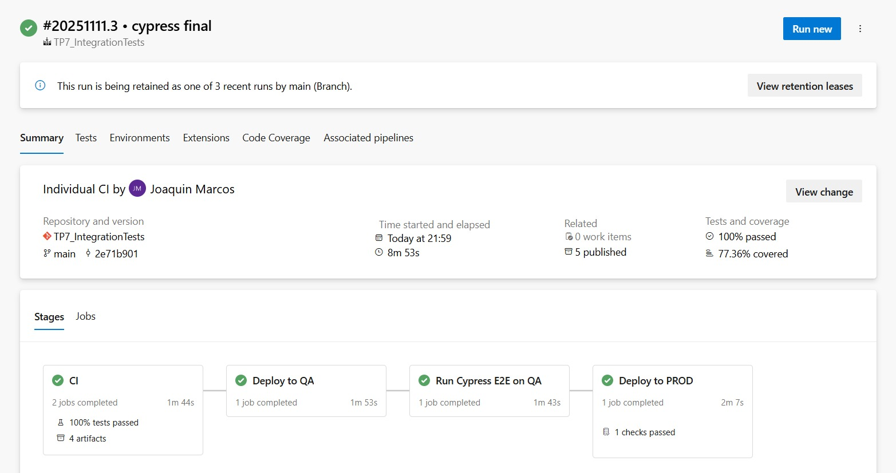
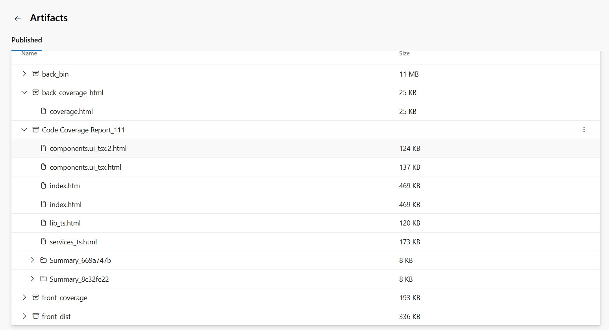
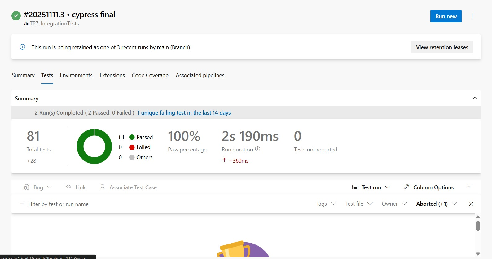


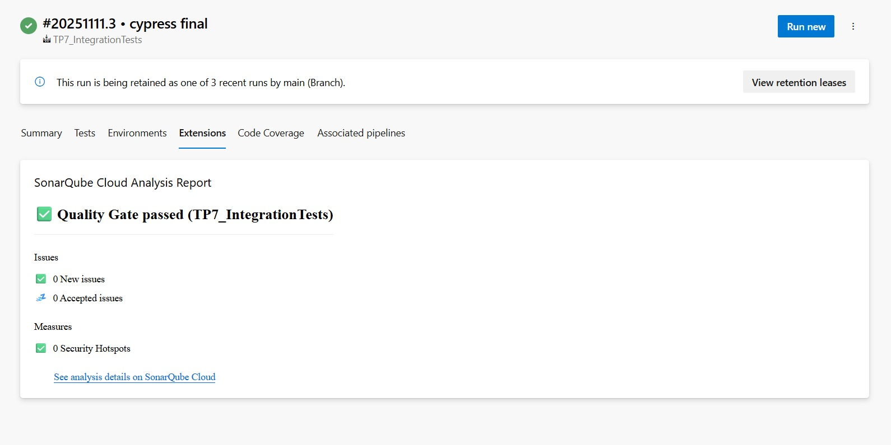
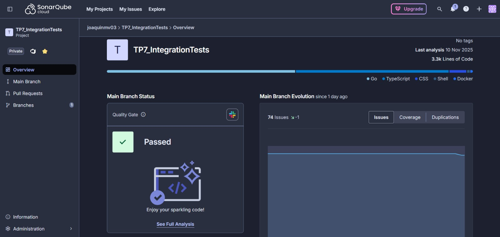