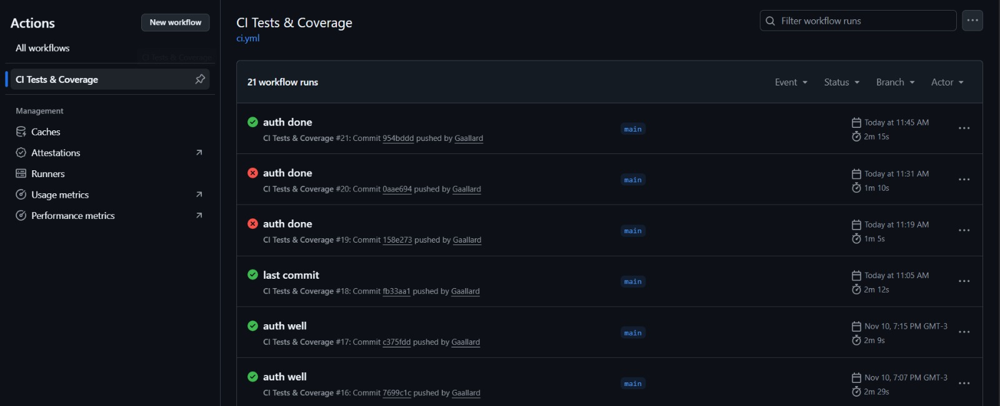
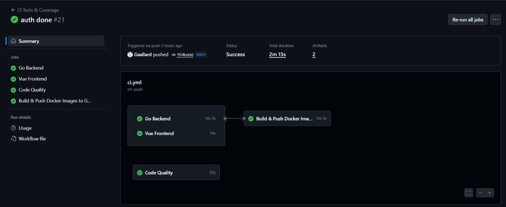
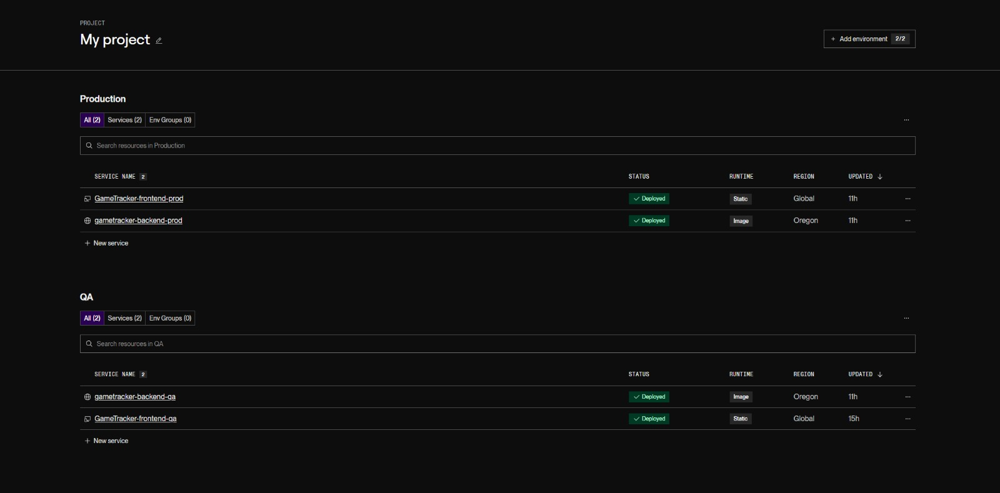
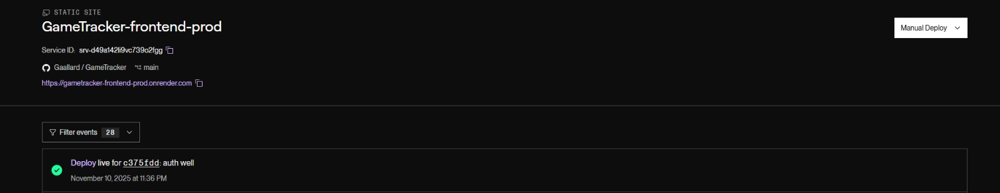
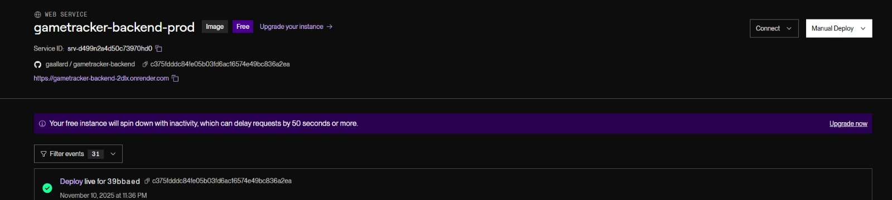
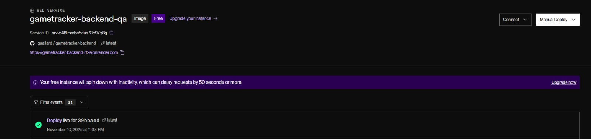
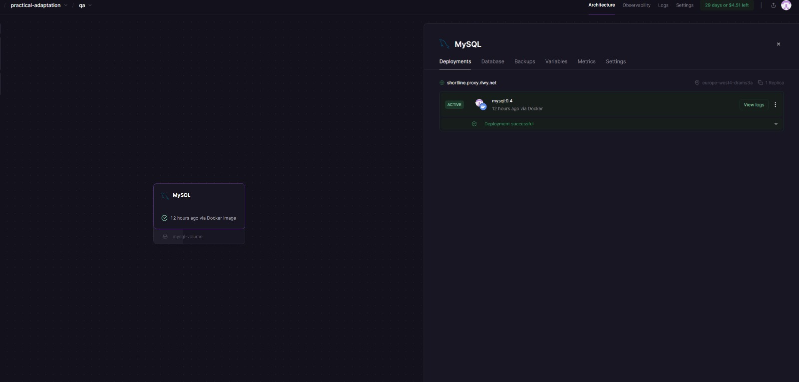
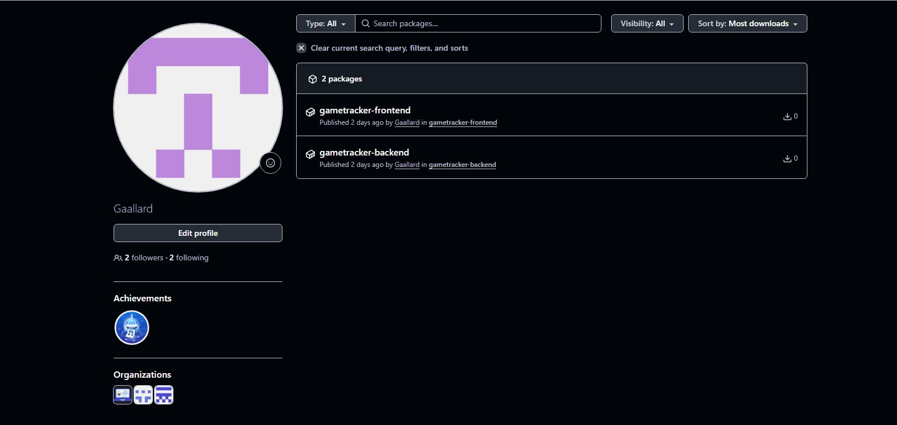

# Trabajo Práctico 8 - Contenedores en Azure y Automatización

## Acceso al proyecto
 
- Repositorio: https://github.com/Gaallard/GameTracker

La aplicación cuenta frontend en React + TypeScript + Vite y backend en Go.

---

## Decisiones Arquitectónicas y Tecnológicas

### Stack Tecnológico

#### Backend: Go (Golang) + Gin + GORM
Lo elegimos porque Go es rápido, liviano y fácil de contenerizar. Gin da un router muy eficiente y GORM simplifica el acceso a la base de datos sin tener que escribir SQL manual. Además, Go tiene una integración excelente con Docker y su rendimiento es ideal para microservicios chicos.

#### Frontend: React con Vite + TypeScript
Usamos Vite porque compila rapido y es muy cómodo para proyectos chicos/medianos. TypeScript lo elegimos para tener tipado fuerte y evitar bugs tontos. Todo el frontend se comunica con el backend mediante fetch a las rutas expuestas del API.

#### DB: MySQL
Elegimos MySQL porque nos parecio la mejor opcion para la idea de aplicacion aparte de integrarse muy fácil con GORM. Lo montamos usando Railway por la facilidad de tener credenciales y entorno gestionado.

### Servicios cloud

#### Container Registry: GitHub Container Registry (GHCR)
Al código hosteado en GitHub nos mantener el CI/CD todo dentro del mismo ecosistema. Además, GHCR se integra directo con GitHub Actions, lo que simplifica el push de las imágenes generadas.

#### Hosting: Render
Usamos Render porque es simple y soporta tanto apps con Docker como static sites. Además, nos deja separar fácilmente el entorno QA del entorno PROD con configuraciones distintas. A diferencia de Railway, Render tiene muy buen soporte para auto-deploy por branch.

#### CI/CD: GitHub Actions
Elegimos esto por su integración nativa con el repositorio y porque podemos ejecutar los tests de Go y de frontend antes de construir las imágenes y subirlas a GHCR.

### Decisión QA vs PROD

Usamos Render tanto para QA como para PROD, pero en servicios separados.
- QA apunta a una base de datos diferente y usa log level debug
- PROD usa release y tiene variables separadas.

Esto nos permite:

- Probar features en QA sin romper producción.
- Mantener dos URLs distintas para verificar deploys.
- Usar una base MySQL independiente para cada entorno.

### Configuración de recursos

**Backend: 0.5 CPU / 512 MB RAM (tanto QA como PROD)**
Render ajusta eso automáticamente, pero en PROD activé el modo “Always On” para evitar cold starts.

**Frontend: es un sitio estático (sin servidor)**
Render lo sirve directo desde su CDN. No necesita instancias ni CPU dedicada.

---

## Implementación

### Container Registry

Las imágenes tanto del backend como frontend se generan automáticamente con cada push.


- Tags: se suben con el SHA del commit y con latest.
- Permisos: configuramos GITHUB_TOKEN como secret para permitir el push automático desde Actions sin credenciales extra.

### Ambiente QA

- **URL Backend:** https://gametracker-backend-qa.onrender.com
- **URL Frontend:** https://gametracker-frontend-qa.onrender.com

**Variables de entorno:**

ENVIRONMENT=qa
LOG_LEVEL=debug
DB_HOST=mysql.railway.internal
DB_USER=root
DB_PASSWORD=*
DB_NAME=gametracker_qa
API_PORT=8080

**Recursos:** 512MB RAM, 0.5 CPU, 1 instancia.

Render usa escalado automático según demanda.

### Ambiente PROD

- **URL Backend:** https://gametracker-backend-prod.onrender.com
- **URL Frontend:** https://gametracker-frontend-prod.onrender.com

**Recursos:** Igual que QA, pero con “Always On” activado y sin logs de debug.

**Deploy automático:** Cada vez que se hace push o merge a main, GitHub Actions corre los tests y si todo pasa Render redeploya automáticamente. Tambien se aplican variables separadas (DB_NAME=gametracker_prod), nivel de log reducido y CORS restringido al dominio público del front.

### Pipeline CI/CD
```yaml
El pipeline está en .github/workflows/ci.yml e incluye tres etapas principales:

- Backend tests y coverage (Go + gotestsum)
- Frontend tests con Vitest
- Build & push de imágenes a GHCR
- Auto deploy en Render (QA y PROD)

Cada etapa deja reportes de coverage y logs en GitHub Actions.

ame: CI Tests & Coverage

on:
  push:
    branches: [ "main" ]
  pull_request:

permissions:
  contents: read
  packages: write

jobs:
  backend:
    name: Go Backend
    runs-on: ubuntu-latest
    defaults:
      run:
        working-directory: backend
    steps:
      - uses: actions/checkout@v4
      
      - uses: actions/setup-go@v5
        with:
          go-version: '1.22.x'
      
      - name: Install testing tools
        run: |
          go install gotest.tools/gotestsum@latest
          go install github.com/jstemmer/go-junit-report/v2@latest
          echo "${HOME}/go/bin" >> $GITHUB_PATH
      
      - name: Install dependencies
        run: go mod tidy
      
      - name: Run tests with coverage
        run: |
          gotestsum --format=standard-verbose --junitfile test-results-go.xml -- \
            -covermode=atomic -coverprofile=coverage.out -coverpkg=./service,./controller,./models ./service ./controller ./models
          go tool cover -func=coverage.out > coverage.txt
          go tool cover -html=coverage.out -o coverage.html
      
      - name: Check coverage threshold
        run: |
          awk '/total:/ { gsub("%","",$3); if ($3+0 < 70) { print "❌ Coverage below 70%: " $3"%"; exit 1 } else { print "✅ Coverage: " $3"%" } }' coverage.txt
      
      - name: Upload backend test artifacts
        uses: actions/upload-artifact@v4
        with:
          name: backend-reports
          path: |
            backend/test-results-go.xml
            backend/coverage.*

  frontend:
    name: Vue Frontend
    runs-on: ubuntu-latest
    defaults:
      run:
        working-directory: frontend/gameTracker
    steps:
      - uses: actions/checkout@v4
      
      - uses: actions/setup-node@v4
        with:
          node-version: '20'
      
      - name: Install dependencies
        run: npm ci
      
      - name: Run tests with coverage
        run: npm run coverage
      
      - name: Upload frontend test artifacts
        uses: actions/upload-artifact@v4
        with:
          name: frontend-reports
          path: |
            frontend/gameTracker/test-results-vue.xml
            frontend/gameTracker/coverage/**

  lint:
    name: Code Quality
    runs-on: ubuntu-latest
    steps:
      - uses: actions/checkout@v4
      
      - name: Backend Lint
        run: |
          cd backend
          go vet ./...
          go fmt ./...
      
      - name: Frontend Lint
        run: |
          cd frontend/gameTracker
          npm ci
          npm run lint

  docker-images:
    name: Build & Push Docker Images to GHCR
    runs-on: ubuntu-latest
    needs: [backend, frontend]   
    steps:
      - uses: actions/checkout@v4

      - name: Login to GitHub Container Registry
        run: |
          echo "${{ secrets.GITHUB_TOKEN }}" | docker login ghcr.io -u "${{ github.actor }}" --password-stdin

      - name: Build & push backend image
        run: |
          REPO_OWNER=$(echo "${{ github.repository_owner }}" | tr '[:upper:]' '[:lower:]')
          BACKEND_IMAGE="ghcr.io/${REPO_OWNER}/gametracker-backend"
          TAG_SHA="${{ github.sha }}"

          # build
          docker build -t "$BACKEND_IMAGE:$TAG_SHA" ./backend

          # tag 'latest' además del sha
          docker tag "$BACKEND_IMAGE:$TAG_SHA" "$BACKEND_IMAGE:latest"

          # push ambas tags
          docker push "$BACKEND_IMAGE:$TAG_SHA"
          docker push "$BACKEND_IMAGE:latest"

      - name: Build & push frontend image
        run: |
          REPO_OWNER=$(echo "${{ github.repository_owner }}" | tr '[:upper:]' '[:lower:]')
          FRONTEND_IMAGE="ghcr.io/${REPO_OWNER}/gametracker-frontend"
          TAG_SHA="${{ github.sha }}"

          # build
          docker build -t "$FRONTEND_IMAGE:$TAG_SHA" ./frontend/gameTracker

          # tag 'latest'
          docker tag "$FRONTEND_IMAGE:$TAG_SHA" "$FRONTEND_IMAGE:latest"

          # push ambas tags
          docker push "$FRONTEND_IMAGE:$TAG_SHA"
          docker push "$FRONTEND_IMAGE:latest"
```




---

## Análisis Comparativo QA vs PROD

| **Aspecto**       | **QA**                      | **PROD**                     | **Justificación**                               |
|--------------------|-----------------------------|-------------------------------|--------------------------------------------------|
| **Servicio usado** | Render                      | Render                        | Uso el mismo proveedor por simplicidad           |
| **CPU/Memoria**    | 0.5 CPU / 512 MB            | 0.5 CPU / 512 MB              | App liviana, no requiere más                     |
| **Instancias**     | 1 (auto sleep)              | 1 (Always On)                 | PROD debe estar siempre disponible               |
| **Escalabilidad**  | Automática básica           | Automática + prioridad        | Render maneja load balancer simple               |
| **Costos**         | Gratis                      | Gratis / low tier             | Perfecto para entorno académico                  |
| **Monitoreo**      | Logs visibles en panel      | Logs + métricas activadas     | En PROD activo más visibilidad                   |

### Ventajas del mismo servicio

- Menos fricción debido a un mismo panel, misma interfaz.
- Deploy más rápido.
- Menor complejidad de mantenimiento.

### Desventajas

- Menos aislamiento físico entre entornos.
- QA puede consumir recursos del mismo cluster.

### Alternativas consideradas

- **Railway:** es una buena opción por su integración con bases y containers, pero nos dio más flexibilidad Render con los auto deploys.

- **Fly.io / Vercel:** descartadas por limitaciones del backend Go con MySQL en free tier.

### Escalabilidad a futuro

Si la app creciera se podria: 
- Migrar a Kubernetes (GKE o DigitalOcean) para escalar horizontalmente los pods del backend.
- Usar una base externa tipo PlanetScale.
- Configurar caching con Redis y CDN para imágenes del frontend.

---

## Evidencias








